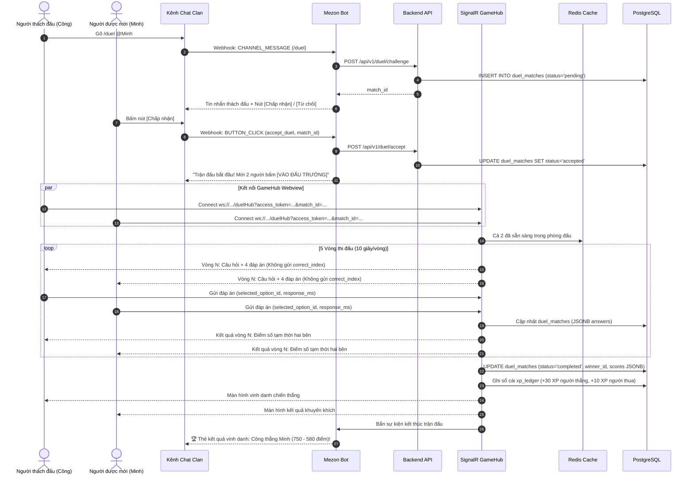

# 🏛️ TÀI LIỆU THIẾT KẾ KIẾN TRÚC HỆ THỐNG (SYSTEM ARCHITECTURE)
## DỰ ÁN: LINGUAL — NỀN TẢNG HỌC NGOẠI NGỮ CỘNG ĐỒNG TRÊN MEZON

> **Chương trình:** Mezon Campus Studio 2026 (NCC+ & Mezon Platform)  
> **Tác giả / Lead Architect:** Ngô Văn Công  
> **Thành viên:** Nguyễn Công Minh (DB/Backend), Phan Phước Trí (Frontend/QA)  
> **Phiên bản:** v1.1 CHÍNH THỨC — Chuẩn hóa .NET 8 Modular Monolith & Single-Clan Mezon Bot (05/10/2026)  

---

## 1. 🌐 SƠ ĐỒ KIẾN TRÚC TỔNG THỂ (HIGH-LEVEL ARCHITECTURE)

Lingual được xây dựng theo mô hình **Modular Monolith** trên nền tảng **.NET 8 (C#)** kết hợp **Next.js 14 (Webview Channel Mini-App)**, tích hợp đa chiều với hệ sinh thái **Mezon Platform**:

```mermaid
graph TD
    subgraph "Mezon Ecosystem"
        MezonApp["Mezon Client (Desktop / Mobile / Web)"]
        MezonGateway["Mezon Gateway (Webhook Events & WebSocket)"]
        MezonApp -->|Tương tác Chat / Slash Command| MezonGateway
        MezonApp -->|Mở Tab Channel Mini-App (Iframe)| WebviewApp
    end

    subgraph "Lingual System Architecture (.NET 8 Modular Monolith)"
        MezonGateway -->|Webhook / Events (HMAC Verify)| BotAdapter["🤖 Mezon Bot Adapter\n(Command Router & Event Dispatcher)"]
        
        WebviewApp["🎨 Channel Mini-App\n(Next.js 14 App Router / TailwindCSS)"]
        
        WebviewApp -->|REST API (JWT Bearer)| ApiGateway["⚡ ASP.NET Core Web API\n(Minimal APIs / Controllers)"]
        WebviewApp <-->|Realtime WebSocket\n(JWT via Query String)| SignalRHub["⚔️ SignalR GameHub\n(Word Duel Realtime Engine)"]
        
        BotAdapter <-->|In-Process MediatR / Service Bus| AppCore["🧠 Application Core (Modular Monolith)"]
        ApiGateway <-->|In-Process MediatR / Service Bus| AppCore
        SignalRHub <-->|In-Process MediatR / Service Bus| AppCore
        
        subgraph "Business Modules"
            M1["Module 01: Identity & Roles"]
            M2["Module 02: Curriculum & Vocab"]
            M3["Module 03: Learning & SM-2 SRS"]
            M4["Module 04: Interactive Quiz Engine"]
            M5["Module 05: Single-Clan Community Bot"]
            M6["Module 06: Competition & Word Duel"]
            M7["Module 07: AI Tutor LingLing"]
            M8["Module 08: Analytics & Retention"]
        end
        AppCore --> M1 & M2 & M3 & M4 & M5 & M6 & M7 & M8
    end

    subgraph "Infrastructure & Data Services"
        Postgres[("🐘 PostgreSQL 16\n(9 Modules · 22 Tables Core MVP · Append-only XP Ledger)")]
        RedisCache[("⚡ Redis 7\n(Sliding Rate Limiter, Game State, Token Cache)")]
        GeminiAI["🧠 Google Gemini API\n(Grammar Correction & Multi-turn Roleplay)"]
        
        AppCore --> Postgres
        AppCore --> RedisCache
        M7 --> GeminiAI
        SignalRHub --> RedisCache
    end
```

---

## 2. 🎯 QUYẾT ĐỊNH KIẾN TRÚC TRỌNG YẾU (ARCHITECTURAL DECISIONS)

### ADR-01: Kiến trúc Single-Clan Mezon Bot (`bot_configuration`)
* **Bối cảnh:** Mezon Platform cho phép Bot hoạt động trong các Clan cộng đồng. Ban đầu nhóm cân nhắc kiến trúc đa Clan (Multi-tenant).
* **Quyết định:** Chuyển sang mô hình **Single-Clan Dedicated Bot**:
  - Bot được cấu hình gắn chặt với **1 Clan trường học / cộng đồng cụ thể** thông qua bản ghi singleton `bot_configuration` (ràng buộc `CHECK (id = 1)`).
  - Thành viên Clan được quản lý trực tiếp qua `users` (Simple RBAC) và phân quyền quản trị viên nội bộ Clan qua `clan_moderator_grants`.
* **Lợi ích:**
  - Loại bỏ hoàn toàn sự phức tạp của việc phân vùng dữ liệu đa Clan (Tenant Isolation, Tenant Migration).
  - Tối ưu hiệu năng truy vấn: Mọi thống kê (`weekly_leaderboards`, `clan_quiz_sessions`) đều tập trung cho một cộng đồng duy nhất.
  - Phù hợp hoàn hảo với tiêu chí và phạm vi cuộc thi Mezon Campus Studio 2026.

### ADR-02: Cơ chế Điểm thưởng Sổ cái Bất biến (`xp_ledger` Append-Only Ledger)
* **Bối cảnh:** Trong game học tập, người dùng thường bấm nút nhanh hoặc gặp sự cố mạng chập chờn gửi request liên tiếp (race condition), dẫn đến nguy cơ cộng trùng điểm hoặc sai lệch thứ hạng.
* **Quyết định:** Áp dụng mô hình **Append-Only Ledger**:
  - Không bao giờ cập nhật trực tiếp biến động điểm vào bảng User.
  - Mọi điểm thưởng (+5 từ mới, +3 ôn tập, +10 quiz, +25 bài học, +30 duel) đều được ghi nhận vào bảng `xp_ledger` kèm trường `idempotency_key UNIQUE` và index `uq_xp_ledger_source`.
  - Tổng điểm có thể tổng hợp trực tiếp từ sổ cái, đảm bảo tính toàn vẹn kiểm toán (Audit Trail) 100%.

### ADR-03: Luồng Trải nghiệm Đấu trường Word Duel 3 Bước
* **Bối cảnh:** Thi đấu đối kháng 1vs1 cần thời gian phản xạ nhanh (10 giây/câu), có âm thanh và đếm ngược. Nếu tổ chức trên kênh chat sẽ gây spam tin nhắn liên tục làm phiền các thành viên khác.
* **Quyết định chuẩn UX Mezon 3 bước:**
  1. **Khởi xướng:** Gõ `/duel @user` trên kênh chat Clan ➔ Bot gửi tin nhắn thách đấu kèm 2 nút bấm tương tác **[Chấp nhận]** / **[Từ chối]**.
  2. **Đấu trường:** Khi chấp nhận, cả 2 chuyển sang màn hình **Channel Mini-App (Webview nhúng Mezon)** kết nối SignalR GameHub để thi đấu 5 vòng đối kháng 10s/vòng (không spam kênh chat, âm thanh mượt mà, server là nguồn sự thật).
  3. **Vinh danh:** Kết thúc trận, Bot tự động gửi **Thẻ vinh danh kết quả kèm XP** vào lại kênh chat Clan để thúc đẩy phong trào.

---

## 3. 🧩 CẤU TRÚC PHÂN RÃ MODULE (.NET 8 MODULAR MONOLITH)

Hệ thống backend được tổ chức thành 7 project sạch sẽ trong Solution `.NET 8`:

```text
src/
├── Lingual.Domain/                     # Core Domain Entities, Value Objects, Domain Events
│   ├── Common/ (AggregateRoot, Entity, IIdempotentCommand)
│   ├── Identity/ (User, LearnerProfile, PlacementTest)
│   ├── Curriculum/ (Course, Unit, Lesson, VocabularyItem)
│   ├── Learning/ (LessonProgress, SrsCard, XpLedger, UserStreak)
│   ├── Quiz/ (Quiz, QuizQuestion, QuizAttempt)
│   ├── Community/ (BotConfiguration, ClanQuizSession, ClanModeratorGrant)
│   ├── Competition/ (DuelMatch, WeeklyLeaderboard)
│   ├── Assistant/ (AiScenario, AiConversation)
│   └── Audit/ (AuditLog)
│
├── Lingual.Infrastructure/             # Data Access & External Integrations
│   ├── Persistence/
│   │   ├── LingualDbContext.cs         # EF Core 8 DbContext (cấu hình 22 bảng Core MVP & JSON Columns)
│   │   └── Migrations/                 # EF Core Code-First Migrations
│   ├── Caching/
│   │   └── RedisCacheService.cs        # Redis 7 (Sliding Window, Active Game Session)
│   ├── External/
│   │   ├── GeminiApiClient.cs          # Google Gemini 1.5 Flash Client
│   │   └── MezonGatewayClient.cs       # Mezon Webhook & Bot API Client
│   └── Security/
│       └── MezonHmacValidator.cs       # Kiểm tra chữ ký HMAC SHA-256 (X-Mezon-Signature)

│
├── Lingual.Application/                # Use Cases, CQRS Handlers (MediatR), DTOs
│   ├── Identity/
│   ├── Curriculum/
│   ├── Learning/ (Sm2AlgorithmService, XpRewardService)
│   ├── Community/ (ClanQuizOrchestrator)
│   └── Competition/ (DuelMatchManager)
│
├── Lingual.Api/                        # ASP.NET Core Web API Host
│   ├── Controllers/ (Auth, Lessons, Srs, Quiz, Leaderboard, AI)
│   ├── Webhooks/ (MezonWebhookEndpoint)
│   └── Program.cs
│
├── Lingual.Realtime/                   # SignalR GameHub
│   └── Hubs/
│       └── WordDuelHub.cs              # Quản lý vòng đấu 10s, đếm ngược, broadcast câu hỏi
│
├── Lingual.Bot/                        # Mezon Bot Service Worker
│   └── Services/
│       ├── BotEventConsumer.cs         # Lắng nghe sự kiện CHANNEL_MESSAGE, BUTTON_CLICK
│       └── BotScheduleWorker.cs        # Quartz/HostedService gửi Word of the Day 8h sáng
│
└── Lingual.Webview/                    # Next.js 14 Webview Nhúng Mezon (Channel Mini-App)
    ├── src/app/ (layout, dashboard, learn, srs, duel, ai)
    ├── src/components/ (Flashcard3D, QuizCountdown, ArenaCanvas)
    └── src/lib/ (signalr-client, mezon-sdk-bridge)
```

---

## 4. 🔄 SƠ ĐỒ TUẦN TỰ ĐẤU TRƯỜNG WORD DUEL (SIGNALR REALTIME)



---

## 5. 🛡️ CHIẾN LƯỢC BẢO MẬT & KIỂM TOÁN (NCC+ SECURITY AUDIT)

Tuân thủ nghiêm ngặt các tiêu chuẩn bảo mật cho dự án sinh viên trong hệ sinh thái NCC+:

1. **Xác thực chữ ký số Webhook (`X-Mezon-Signature`):**
   - Mọi webhook từ Mezon Gateway gửi về đều chứa header HMAC SHA-256.
   - Middleware `MezonHmacValidator` tính toán hash từ request body với `MEZON_WEBHOOK_SECRET`. Nếu không khớp, từ chối ngay với mã `HTTP 401 Unauthorized`.
2. **Xác thực phiên làm việc Webview (Mezon SSO Handshake):**
   - Khi Next.js mở trong Webview Mezon, client gửi context token lên `/api/v1/auth/mezon-sso` để xác minh chữ ký số của Mezon.
   - API cấp phát JWT ngắn hạn (15 phút) lưu trong bộ nhớ (Memory/SessionStorage).
3. **SignalR Query String Token Verification:**
   - Client SignalR gửi JWT qua query string `?access_token=...`.
   - Backend cấu hình `JwtBearerEvents.OnMessageReceived` đọc token an toàn, ngăn chặn kết nối trái phép vào GameHub.
4. **Phòng vệ DoS / Spam (Sliding-window Rate Limiting):**
   - Tích hợp Redis Sliding Window giới hạn tối đa **5 requests/giây/user**. Nếu vượt quá ngưỡng, hệ thống trả về mã `HTTP 429 Too Many Requests` hoặc Bot im lặng bỏ qua tin nhắn rác.
5. **Bảo vệ Bí mật (Zero Secret Leaks):**
   - Tuyệt đối không commit token hay database credential vào repository. Sử dụng biến môi trường chuẩn `.env` (mẫu `.env.example`).
6. **Nhật ký Kiểm toán Bất biến (Append-Only Audit Logs - ADM-09/12):**
   - Mọi thay đổi phân quyền Admin, cấp/thu hồi quyền `clan_moderator_grants`, hay thay đổi cấu hình Bot đều được lưu vào bảng `audit_logs` (Module 09).
   - Quyền `UPDATE` và `DELETE` trên bảng `audit_logs` bị thu hồi hoàn toàn khỏi service account trong production nhằm đảm bảo tính không thể chối bỏ (non-repudiation).

