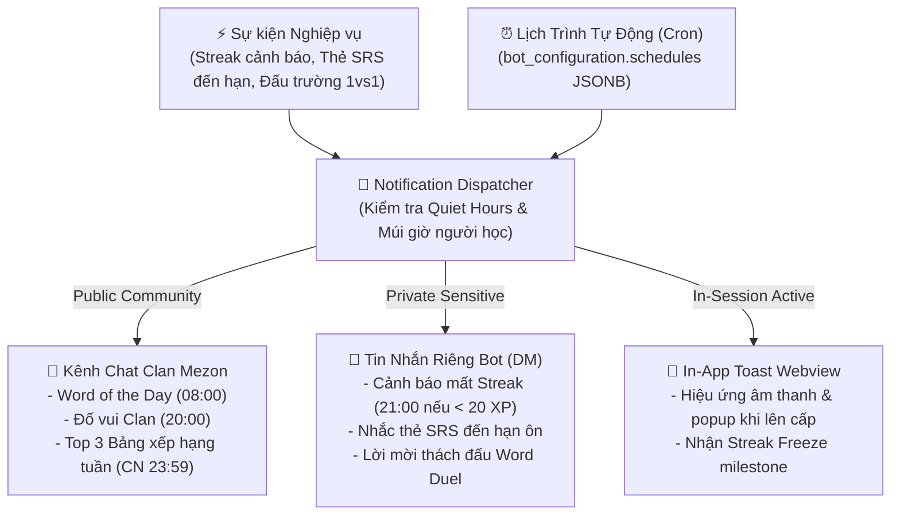

# 🔔 LINGUAL — KIẾN TRÚC THÔNG BÁO & NHẮC NHỞ (NOTIFICATION ARCHITECTURE)
## DỰ ÁN: NỀN TẢNG HỌC NGOẠI NGỮ CỘNG ĐỒNG TRÊN MEZON PLATFORM

> **Chương trình:** Mezon Campus Studio 2026 (NCC+ & Mezon Platform)  
> **Đội ngũ (Team 05 — Đụt Cận Trĩ):** Ngô Văn Công (Lead), Nguyễn Công Minh (DB/Backend), Phan Phước Trí (Frontend/QA)  
> **Mentor:** Mai Hồng Mận  
> **Phiên bản:** v1.1 (Đồng bộ CSDL 22 bảng Core MVP)  

---

## 1. CHIẾN LƯỢC ĐIỀU PHỐI THÔNG BÁO

Hệ thống Lingual tận dụng tối đa lợi thế của nền tảng **Mezon Platform** để gửi thông báo đa kênh, bảo đảm người học không bị quên lịch ôn tập nhưng không gây phiền nhiễu (spam fatigue):



---

## 2. QUẢN LÝ LỊCH TRÌNH ĐỘNG (`bot_configuration.schedules`)

Trong CSDL 22 bảng Core MVP, toàn bộ lịch tự động phát thông báo của Bot được lưu trữ dưới dạng mảng JSONB trong bản ghi singleton `bot_configuration`:

```json
[
  {
    "type": "word_of_the_day",
    "cron": "0 8 * * *",
    "channel_id": "2104407385626906624",
    "enabled": true
  },
  {
    "type": "daily_clan_quiz",
    "cron": "0 20 * * *",
    "channel_id": "2104407385626906624",
    "duration_seconds": 30,
    "enabled": true
  },
  {
    "type": "weekly_podium_broadcast",
    "cron": "59 23 * * 0",
    "channel_id": "2104407385626906624",
    "enabled": true
  }
]
```

Clan Moderator có thể bật/tắt hoặc điều chỉnh thời gian phát thông báo trên giao diện cấu hình Bot mà không cần khởi động lại dịch vụ backend.

---

## 3. CHÍNH SÁCH GIỜ YÊN TĨNH & AN TOÀN TRẢI NGHIỆM

1. **Tuân thủ múi giờ người học (`users.timezone`):** Mọi cảnh báo cá nhân được tính toán dựa trên múi giờ thực tế của học viên (mặc định `Asia/Ho_Chi_Minh`).
2. **Khung giờ yên tĩnh (Quiet Hours):** Hệ thống chặn toàn bộ thông báo chủ động (push notification/DM) từ **22:30 đến 07:00 sáng hôm sau**.
3. **Giới hạn tần suất nhắc nhở:** Tối đa 1 thông báo nhắc học cá nhân mỗi ngày để tránh gây ức chế tâm lý cho người dùng.
