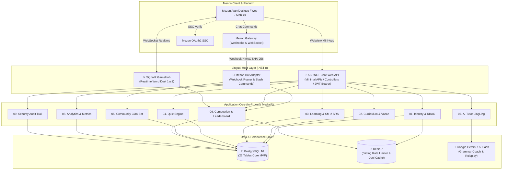

# 📐 LINGUAL — HỆ THỐNG THIẾT KẾ KIẾN TRÚC TỔNG THỂ (SYSTEM DESIGN)
## DỰ ÁN: NỀN TẢNG HỌC NGOẠI NGỮ CỘNG ĐỒNG TRÊN MEZON PLATFORM

> **Chương trình:** Mezon Campus Studio 2026 (NCC+ & Mezon Platform)  
> **Đội ngũ (Team 05 — Đụt Cận Trĩ):** Ngô Văn Công (Lead), Nguyễn Công Minh (DB/Backend), Phan Phước Trí (Frontend/QA)  
> **Mentor:** Mai Hồng Mận  
> **Phiên bản:** v1.1 (Đồng bộ CSDL 22 bảng Core MVP)  

---

## 1. TỔNG QUAN KIẾN TRÚC HỆ THỐNG

Lingual được thiết kế theo mô hình **Modular Monolith** trên nền tảng **ASP.NET Core 8**, kết hợp **Next.js 14 App Router** làm Channel Mini-App (Webview nhúng trực tiếp trong Mezon client) và **Mezon Bot Worker** phục vụ tương tác chat thời gian thực.

---

## 2. PHÂN RÃ CÁC MODULE NGHIỆP VỤ & PHẠM VI DỮ LIỆU

Hệ thống bao gồm 9 module tương ứng với lược đồ 22 bảng CSDL chuẩn:

| Module | Trách nhiệm chính | Thực thể CSDL chính (PostgreSQL 16) |
| :--- | :--- | :--- |
| **01. Identity & RBAC** | Xác thực Mezon SSO, quản lý hồ sơ học viên, bài kiểm tra xếp lớp CEFR, Simple RBAC (`learner`, `moderator`, `admin`). | `users`, `learner_profiles`, `placement_tests` |
| **02. Curriculum** | Quản lý khóa học CEFR (A1–B2), chương học, bài học và kho từ vựng kèm ví dụ song ngữ. | `courses`, `units`, `lessons`, `vocabulary_items` |
| **03. Learning & SRS** | Tiến độ học tập, thuật toán lặp lại ngắt quãng SuperMemo-2 (SM-2), sổ cái điểm kinh nghiệm bất biến (`xp_ledger`), chuỗi Streak và Streak Freeze. | `lesson_progress`, `srs_cards`, `xp_ledger`, `user_streaks` |
| **04. Quiz Engine** | Ngân hàng câu hỏi trắc nghiệm/điền từ/sắp xếp câu (options JSONB) và lịch sử làm bài thi. | `quizzes`, `quiz_questions`, `quiz_attempts` |
| **05. Community Bot** | Cấu hình Bot Single-Clan (`bot_configuration`), lịch tự động (JSONB), phiên đố vui Clan (`clan_quiz_sessions`) và cấp quyền quản trị Clan. | `bot_configuration`, `clan_quiz_sessions`, `clan_moderator_grants` |
| **06. Competition** | Đấu trường từ vựng 1vs1 thời gian thực (`duel_matches`) và bảng xếp hạng tuần nội bộ Clan (`weekly_leaderboards`). | `duel_matches`, `weekly_leaderboards` |
| **07. AI Assistant** | Kịch bản đóng vai giao tiếp và lịch sử hội thoại sửa lỗi ngữ pháp cùng Mascot LingLing (Google Gemini API). | `ai_scenarios`, `ai_conversations` |
| **08. Analytics** | Báo cáo retention và chỉ số gắn kết (truy vấn trực tiếp từ `xp_ledger` và `lesson_progress`). | View / Aggregate Queries |
| **09. Security Audit** | Sổ nhật ký kiểm toán bất biến ghi nhận mọi thao tác phân quyền, thay đổi cấu hình và sự kiện nhạy cảm (ADM-09). | `audit_logs` |

---

## 3. THIẾT KẾ ĐẶC THÙ CHO HỆ SINH THÁI MEZON

### 3.1 Kiến trúc Single-Clan Dedicated Bot
- Bot được cấu hình phục vụ **chính xác 1 Clan Mezon** xác định qua bản ghi singleton `bot_configuration` (`id = 1`).
- Loại bỏ sự phức tạp của cơ chế đa tenant; toàn bộ BXH và sự kiện quiz tập trung cho cộng đồng học viên của Clan trường học.
- Quản trị viên cộng đồng nhận grant thông qua bảng `clan_moderator_grants`.

### 3.2 Luồng Tương tác Kết hợp (Bot Chat + Webview Mini-App)
- **Kênh Chat Clan:** Đóng vai trò phễu tiếp cận (Notification, Slash commands `/learn`, `/quiz`, `/streak`, lời thách đấu `/duel`).
- **Channel Mini-App (Webview Next.js 14):** Đóng vai trò không gian học tập sâu (Học bài mới, lật flashcard 3D, thi đấu SignalR 5 vòng đối kháng, trò chuyện cùng LingLing).

---

## 4. CHỈ TIÊU KỸ THUẬT & SLA HỆ THỐNG
- **Dung lượng chịu tải (CCU):** Tối thiểu 500 người dùng đồng thời.
- **Thời gian phản hồi Bot:** Dưới **500 ms** cho mọi lệnh chat tương tác.
- **Tải trang Mini-App:** Màn hình tương tác đầu tiên (FCP/TTI) dưới **1.5 giây**.
- **Độ sẵn sàng (Availability):** Cam kết đạt **99.5%**.
- **Tính toàn vẹn điểm thưởng:** 100% idempotent thông qua khóa `idempotency_key` và chỉ mục duy nhất `uq_xp_ledger_source`.
