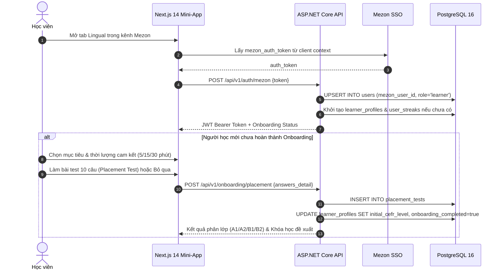
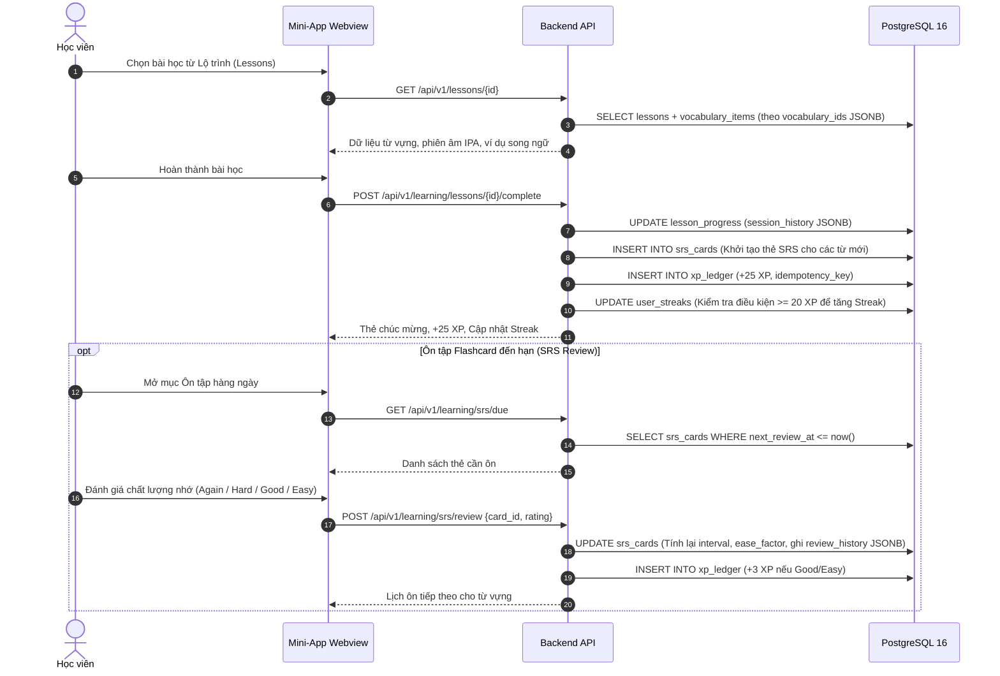
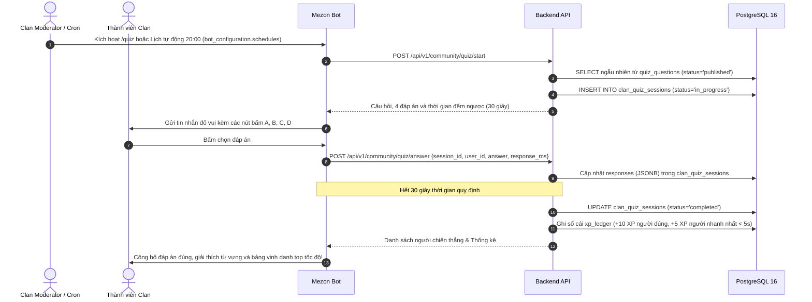
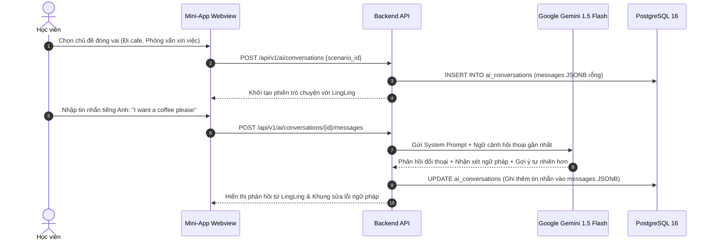

# 🔄 LINGUAL — ĐẶC TẢ QUY TRÌNH HỆ THỐNG (SYSTEM WORKFLOWS)
## DỰ ÁN: NỀN TẢNG HỌC NGOẠI NGỮ CỘNG ĐỒNG TRÊN MEZON PLATFORM

> **Chương trình:** Mezon Campus Studio 2026 (NCC+ & Mezon Platform)  
> **Đội ngũ (Team 05 — Đụt Cận Trĩ):** Ngô Văn Công (Lead), Nguyễn Công Minh (DB/Backend), Phan Phước Trí (Frontend/QA)  
> **Mentor:** Mai Hồng Mận  
> **Phiên bản:** v1.1 (Đồng bộ CSDL 22 bảng Core MVP)  

---

## 1. QUY TRÌNH KHỞI TẠO TÀI KHOẢN & ĐÁNH GIÁ ĐẦU VÀO (ONBOARDING)

---

## 2. QUY TRÌNH HỌC TẬP & ÔN TẬP NGẮT QUÃNG (SRS SM-2)

---

## 3. QUY TRÌNH ĐỐ VUI CỘNG ĐỒNG CLAN (BOT CHAT QUIZ)

---

## 4. QUY TRÌNH ĐẤU TRƯỜNG TỪ VỰNG 1VS1 (WORD DUEL 3 BƯỚC)

1. **Khởi xướng:** Gõ `/duel @user` trên kênh chat Clan ➔ Bot gửi tin nhắn thách đấu kèm 2 nút bấm tương tác **[Chấp nhận]** / **[Từ chối]**.
2. **Đấu trường:** Khi chấp nhận, cả 2 chuyển sang màn hình **Channel Mini-App (Webview nhúng Mezon)** kết nối SignalR GameHub để thi đấu 5 vòng đối kháng 10s/vòng (không spam kênh chat, âm thanh mượt mà, server là nguồn sự thật).
3. **Vinh danh:** Kết thúc trận, Bot tự động gửi **Thẻ vinh danh kết quả kèm XP** vào lại kênh chat Clan để thúc đẩy phong trào.
*(Chi tiết xem sơ đồ tuần tự tại `ARCHITECTURE_DESIGN.md`).*

---

## 5. QUY TRÌNH LUYỆN NÓI CÙNG TRỢ LÝ AI LINGLING (GEMINI FLASH)

