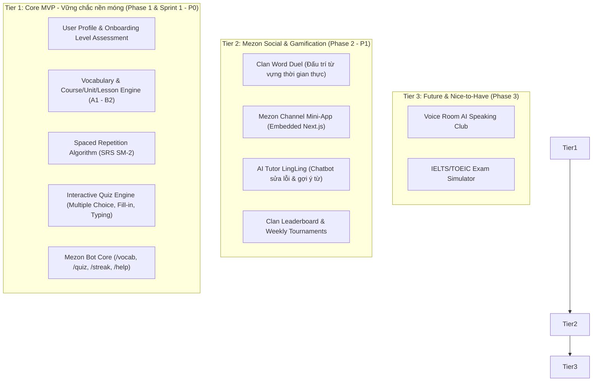
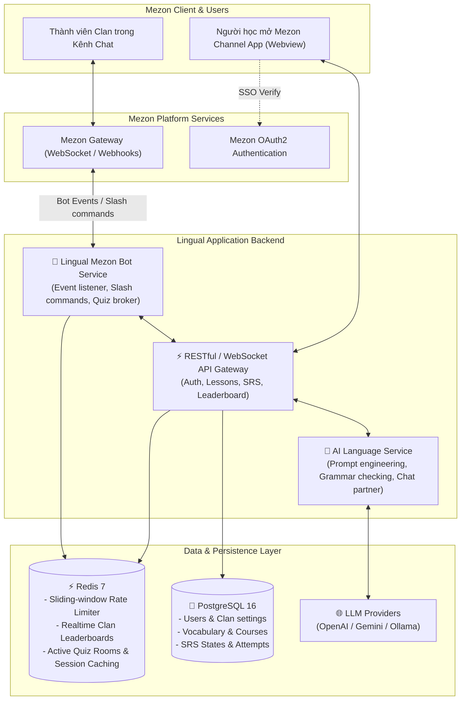

# 🌟 KẾ HOẠCH TỔNG THỂ & THIẾT KẾ ĐỀ TÀI: LINGUAL (LINGUAMEZON)
## DỰ ÁN THỰC CHIẾN MEZON CAMPUS STUDIO 2026 (MCS 2026)

> **Ứng viên / Chủ nhiệm đề tài:** Ngô Văn Công  
> **Chương trình:** Mezon Campus Studio 2026 (NCC+ & Mezon Platform)  
> **Kế thừa & Tái thiết kế từ:** Dự án *LinguaFlow* (Được tinh gọn, module hóa và tối ưu chuyên biệt cho hệ sinh thái Mezon)  
> **Mục tiêu:** Xây dựng nền tảng học ngoại ngữ tương tác xã hội (Social Language Learning Platform) kết hợp Spaced Repetition, Gamification và AI Tutor, hoạt động mượt mà bên trong cộng đồng Mezon Clan.  
> **Tài liệu Nghiệp vụ & Yêu cầu Sản phẩm chi tiết (PRD/SRS):** Xem tại [PRODUCT_REQUIREMENTS_DOCUMENT_LINGUAL.md](PRODUCT_REQUIREMENTS_DOCUMENT_LINGUAL.md)

---

## 🧭 PHẦN 1: TỔNG QUAN DỰ ÁN & TRIẾT LÝ SẢN PHẨM (PRODUCT VISION)

### 1.1 Vấn đề thực tế (The Pain Point)
1. **Sự cô độc và tỷ lệ bỏ cuộc (Drop-out rate) cao:** Học ngoại ngữ một mình trên các app truyền thống rất dễ chán nản. Hơn 80% người học từ bỏ sau 2 tuần đầu tiên do thiếu động lực và thiếu môi trường tương tác hàng ngày.
2. **Khoảng cách giữa học lý thuyết và thực hành xã hội:** Người học thuộc từ vựng nhưng không có môi trường để giao tiếp, thi đấu hoặc thảo luận cùng bạn bè cùng chí hướng.
3. **Hệ sinh thái Mezon đang thiếu mảng EdTech:** Mezon là nền tảng giao tiếp cộng đồng cực kỳ tiềm năng, có sẵn hệ thống Clan, Channel, Voice Room, nhưng còn thiếu các công cụ học tập tương tác gắn kết thành viên.

### 1.2 Giải pháp Lingual trên Mezon
**Lingual** biến việc học ngoại ngữ thành một **trải nghiệm xã hội lôi cuốn (Social & Gamified Learning)**:
- **Học ngắt quãng khoa học (Spaced Repetition System - SRS):** Thuật toán SM-2 nhắc nhở ôn từ đúng "điểm rơi trí nhớ", chỉ 10-15 phút mỗi ngày.
- **Tích hợp sâu vào Mezon Clan (Clan-first Learning):** 
  - Mezon Bot tự động tổ chức mini-game từ vựng (Word Duel, Trivia Quiz) ngay trong kênh chat của Clan.
  - Channel App (Mini-web nhúng) cho phép mở bài học, lật flashcard, làm quiz trực tiếp mà không cần rời khỏi ứng dụng Mezon.
- **AI Practice Partner (LingLing Mascot):** Trợ lý ngôn ngữ thông minh sửa ngữ pháp, chấm điểm phát âm, và đóng vai đối thoại phản xạ 24/7.
- **Tinh thần thi đua đồng đội (Leaderboard & Clan War):** Bảng xếp hạng XP cá nhân và giải đấu giữa các Clan kích thích người học quay lại mỗi ngày (Daily Retention).

---

## 🧩 PHẦN 2: PHÂN RÃ HỆ THỐNG & TÍNH NĂNG THEO MÔ HÌNH KIM TỰ THÁP (FEATURE TIERS)

Thay vì cố gắng ôm đồm quá nhiều tính năng như bản cũ (IELTS mock tests, Speaking shadowing phức tạp, CMS đa cấp) dẫn đến phân tán nguồn lực, Lingual tại MCS 2026 sẽ được cấu trúc theo 3 tầng rõ rệt:



### Chi tiết các phân hệ chức năng:

| Phân hệ | Tính năng cụ thể | Mức độ ưu tiên | Trải nghiệm trên Mezon |
| :--- | :--- | :---: | :--- |
| **1. Core Learning** | - Bộ từ vựng Oxford/CEFR (A1-B2)<br>- Thuật toán ôn tập SRS lặp lại ngắt quãng<br>- Quiz engine: Trắc nghiệm, điền từ, sắp xếp câu | **P0 (Bắt buộc)** | Dữ liệu cốt lõi lưu trên CSDL dùng chung cho cả Web và Bot |
| **2. Mezon Clan Bot** | - Gõ `/learn` để nhận 5 từ mới hôm nay<br>- Gõ `/quiz` để bot đố vui cả kênh chat cùng bấm nút trả lời<br>- Gõ `/streak` kiểm tra chuỗi ngày chăm chỉ | **P0 (Bắt buộc)** | Tương tác trực tiếp bằng tin nhắn, Interactive Buttons, Polls |
| **3. Channel Mini-App** | - Giao diện Webview nhúng vào kênh Mezon<br>- Học theo lộ trình Unit/Lesson trực quan<br>- Lật Flashcard 3D, xem biểu đồ tiến độ | **P1 (Quan trọng)** | Chạy mượt mà trên iframe/webview của Mezon client |
| **4. AI Practice Partner** | - Mascot bò sữa LingLing thân thiện<br>- Sửa lỗi chính tả/ngữ pháp khi chat<br>- Đóng vai luyện hội thoại theo tình huống (Đi cafe, phỏng vấn, du lịch) | **P1 (Quan trọng)** | Tích hợp qua Mezon Bot Direct Message hoặc tab chat riêng |
| **5. Clan Gamification** | - Điểm kinh nghiệm XP, Huy hiệu danh dự<br>- BXH Clan: Thành viên học chăm giúp Clan thăng hạng | **P1 (Quan trọng)** | Kích thích tính cạnh tranh lành mạnh giữa các cộng đồng |

---

## 🏛️ PHẦN 3: THIẾT KẾ KIẾN TRÚC HỆ THỐNG (SYSTEM ARCHITECTURE)



---

## ⚖️ PHẦN 4: BỘ CÔNG NGHỆ CHÍNH THỨC (MENTOR ĐÃ PHÊ DUYỆT)

> [!IMPORTANT]
> **THÔNG TIN DỰ ÁN & HỘI ĐỒNG HƯỚNG DẪN:**
> - **Tên dự án:** **LINGUAL**
> - **Đội ngũ thực hiện:** **Team 05 — Đụt Cận Trĩ** (Mezon Campus Studio Mùa 2 - 2026)
> - **Mentor phụ trách:** **Mai Hồng Mận** (`man.maihong` - ID: `1827994776956309504`)
> - **Nhóm trưởng / Project Lead:** **Ngô Văn Công** (`MCS03_cong.ngovan` - ID: `2100896006294999040`)
> - **Thành viên chủ chốt (3 thành viên):**
>   - **Ngô Văn Công** (`MCS03_cong.ngovan` - ID: `2100896006294999040`): Nhóm trưởng, Kiến trúc sư hệ thống, Chatbot AI Mascot, Mezon Bot Client, SignalR Realtime Hub.
>   - **Nguyễn Công Minh** (`MCS03_minh.nguyencong` - ID: `1967925734009737216`): Kỹ sư CSDL & Backend Core, Thiết kế ERD & EF Core Migrations, Thuật toán SRS SM-2, Gamification Redis.
>   - **Phan Phước Trí** (`MCS03_tri.phanphuoc` - ID: `2041343127796584448`): Kỹ sư Frontend & QA, Phát triển Giao diện Next.js 14 App Router, Chuẩn hóa Dataset từ vựng & Quiz, Kiểm thử tích hợp.
> - **Backend Lõi:** **ASP.NET Core 8 Web API (Kiến trúc Modular Monolith)**
> - **Frontend / Channel Mini-App:** **Next.js 14 (App Router) + Tailwind CSS + Lucide Icons**
> - **Cơ sở dữ liệu & Cache:** **PostgreSQL 16 (Entity Framework Core) + Redis 7**
> - **Realtime Hub:** **ASP.NET Core SignalR (Word Duel 1vs1 Matching)**

### 4.1 Chi tiết Kiến trúc Modular Monolith trên ASP.NET Core:
1. **Module Identity & Users:** Xác thực Mezon SSO OAuth2, JWT Bearer Token, hồ sơ người học và phân quyền.
2. **Module Learning & SRS:** Quản trị danh mục khóa học, bài học, kho từ vựng (Oxford 3000 / CEFR A1-B2) và thuật toán lặp lại ngắt quãng SM-2.
3. **Module Gamification & Battle:** Quản lý điểm kinh nghiệm XP, chuỗi Streak, cấp độ người học, bảng xếp hạng Clan, và **SignalR GameHub** cho các trận đấu từ vựng thời gian thực 1vs1 (Word Duel).
4. **Module Mezon Integration:** Gateway kết nối với Mezon Bot Client, lắng nghe sự kiện chat, xử lý các lệnh `/vocab`, `/quiz`, `/streak`, `/duel` và các nút bấm tương tác (Interactive Buttons).
5. **Module AI Language Tutor:** Mascot LingLing tích hợp Google Gemini API phục vụ sửa lỗi chính tả, giải thích ngữ pháp và đóng vai đối thoại phản xạ.

### 4.2 Cấu trúc Thư mục Dự án Chuẩn:
```text
MezonCampusStudio/
├── src/
│   ├── backend/                     # ASP.NET Core 8 Modular Monolith
│   │   ├── Lingual.Api/             # Web API Host, Middleware, Controllers, SignalR Hubs
│   │   ├── Lingual.Modules.Identity/ # Quản lý người dùng, Mezon SSO, Auth
│   │   ├── Lingual.Modules.Learning/ # Khóa học, từ vựng, thuật toán SRS SM-2
│   │   ├── Lingual.Modules.Gamification/ # XP, Streak, Bảng xếp hạng, Word Duel Hub
│   │   ├── Lingual.Modules.MezonBot/ # Tích hợp Bot Mezon, Event handlers
│   │   ├── Lingual.Modules.AITutor/  # Mascot LingLing, LLM Prompting
│   │   └── Lingual.Shared/          # Kernel dùng chung: Base Entities, Events, Utilities
│   │
│   └── web-app/                     # Next.js 14 App Router (Channel Mini-App)
│       ├── src/app/                 # Layouts, Routes (dashboard, learn, duel, profile)
│       ├── src/components/          # UI Components (Flashcards, Quiz, Navbar, Mascot)
│       ├── src/lib/                 # API Clients, SignalR Connection, State Stores
│       └── public/                  # Static assets & icons
│
├── docs/                            # Hồ sơ dự án, PRD, SRS, ERD, Kiến trúc
├── scripts/                         # Automation & Daily Report Scripts
└── docker-compose.yml               # Môi trường chạy local: PostgreSQL 16 & Redis 7
```

---

## 🗓️ PHẦN 5: LỘ TRÌNH 10 TUẦN TRIỂN KHAI & MỐC NỘP MILESTONE 1

```text
Giai đoạn 1: Khởi động, Đặc tả & Chuẩn bị Môi trường (Tuần 1 - 2)
├── Ngày 02/10/2026: Họp Kickoff với Mentor Mai Hồng Mận, chốt Tech Stack & đề tài LINGUAL.
├── HẠN CHÓT MILESTONE 1 (12/10/2026):
│   ├── [1] Bản vẽ Thiết kế Cơ sở Dữ liệu (Database ERD & Schema) - Nguyễn Công Minh thực hiện.
│   ├── [2] Tài liệu PRD/SRS thống nhất giữa FE và BE - Ngô Văn Công hoàn thiện.
│   ├── [3] Khởi tạo Scaffold dự án Modular Monolith ASP.NET Core + Next.js 14 - Ngô Văn Công thực hiện.
│   └── [4] Kế hoạch phân chia Sprint cho phiên bản MVP ban đầu.
└── Kết thúc Tuần 2: Được Mentor phê duyệt kiến trúc và bắt đầu code Sprint 1.

Giai đoạn 2: Phát triển 4 Sprint MVP (Tuần 3 - 8)
├── Sprint 1 (Tuần 3 - 4): Xây dựng Core Database EF Core, Auth SSO, SRS SM-2 Engine & Course Data.
├── Sprint 2 (Tuần 5 - 6): Xây dựng Mezon Bot với lệnh /vocab, /quiz, /streak và tích hợp mezon-sdk.
├── Sprint 3 (Tuần 7 - 8): Hoàn thiện Channel Mini-App (Webview) và Tích hợp Trợ lý AI LingLing.
└── Sprint 4 (Tuần 9): TÍNH NĂNG ĐÓNG BĂNG (FEATURE FREEZE) - Toàn bộ code hoàn thành ở Tuần 9!
    └── Security Audit (tiêu chuẩn NCC+), Stress Testing SignalR Word Duel & Sửa lỗi toàn diện.

Giai đoạn 3: Nghiệm thu, Demo Day & Bảo vệ (Tuần 10)
└── Triển khai Production, viết Final Documentation, quay video demo hoàn chỉnh và bảo vệ trước Hội đồng.
```

---

## 📋 PHẦN 6: PHÂN CÔNG VAI TRÒ & NHIỆM VỤ THÀNH VIÊN (MILESTONE 1)

| Thành viên | Vai trò | Nhiệm vụ chính trong Milestone 1 (Hạn 12/10) |
| :--- | :--- | :--- |
| **Ngô Văn Công** (`cong.ngovan`) | **Project Lead & Fullstack** | - Quản lý tiến độ tổng thể, đại diện làm việc với Mentor.<br>- Khởi tạo khung dự án ASP.NET Core Modular Monolith + Next.js 14.<br>- Cấu hình Docker Compose (PostgreSQL, Redis) và CI/CD.<br>- Review tài liệu Database Schema / ERD do Minh thiết kế. |
| **Nguyễn Công Minh** (`minh.nguyencong`) | **Backend Engineer** | - Phụ trách thiết kế chi tiết Lược đồ Cơ sở dữ liệu (Database Schema / ERD 22 bảng Core MVP).<br>- Định nghĩa quan hệ các thực thể: Users, Vocabulary, Courses, SRS States, Bot Configuration, Duels, Audit Logs.<br>- Cùng review và thống nhất API Contract với Lead. |
| **Phan Phước Trí** (`tri.phanphuoc`) | **Frontend & QA Engineer** | - Chuẩn hóa bộ dữ liệu từ vựng theo CEFR (A1-B2) và Oxford 3000.<br>- Soạn thảo ngân hàng câu hỏi trắc nghiệm & ngữ cảnh cho Quiz Engine.<br>- Chuẩn bị kịch bản kiểm thử (Test Cases) cho các tính năng MVP và hỗ trợ thiết kế giao diện UI/UX Next.js. |

---

## ⚡ PHẦN 7: KỶ LUẬT VẬN HÀNH & BÁO CÁO DAILY (TEAM RULES)

1. **Báo cáo Daily bắt buộc hàng ngày:**
   - **Địa điểm:** Kênh `#daily-team05` (ID: `2104407385626906624`) trên Mezon.
   - **Cú pháp:** Gõ lệnh `*daily` và điền form của Campus Bot.
   - **Yêu cầu:** Tối thiểu **1 giờ làm việc/ngày** theo đúng chỉ đạo của Mentor Mận.
2. **Quy chuẩn mã nguồn (Git Workflow):**
   - Không push trực tiếp lên branch `main`.
   - Mọi Pull Request (PR) phải có ít nhất 1 code review từ thành viên khác trước khi merge vào `develop`.
   - TUYỆT ĐỐI không commit hoặc push các thông tin nhạy cảm (API Keys, JWT Secrets, Database Passwords) lên GitHub.

