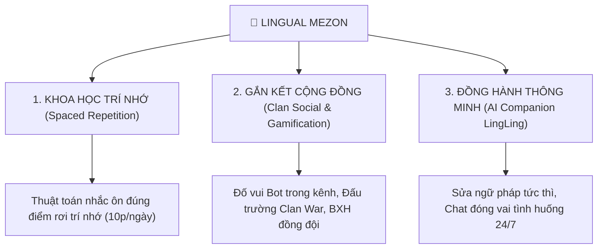
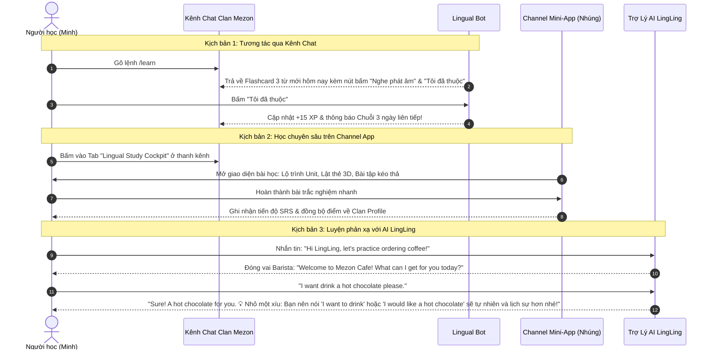

# 📘 TÀI LIỆU YÊU CẦU SẢN PHẨM & ĐẶC TẢ NGHIỆP VỤ (PRD / SRS)
# DỰ ÁN: LINGUAL — NỀN TẢNG HỌC NGOẠI NGỮ CỘNG ĐỒNG TRÊN MEZON

> **Dự án:** Lingual (LinguaMezon) — Social & Gamified Language Learning  
> **Chương trình:** Mezon Campus Studio 2026 (NCC+ & Mezon Platform)  
> **Chủ nhiệm đề tài / Product Owner:** Ngô Văn Công (Lead)  
> **Thành viên:** Nguyễn Công Minh (DB/BE), Phan Phước Trí (FE/QA)  
> **Mentor:** Mai Hồng Mận  
> **Trạng thái tài liệu:** v1.1 CHÍNH THỨC — Thống nhất kiến trúc Single-Clan Bot & CSDL Chuẩn hóa 8 Module (05/10/2026)  
> **Góc nhìn tiếp cận:** Yêu cầu nghiệp vụ, Chân dung khách hàng, Luồng người dùng & Tiêu chuẩn nghiệm thu  

---

## 📑 MỤC LỤC

1. [BỐI CẢNH DỰ ÁN & VẤN ĐỀ KHÁCH HÀNG (BUSINESS CONTEXT & PAIN POINTS)](#1-bối-cảnh-dự-án--vấn-đề-khách-hàng)
2. [TẦM NHÌN SẢN PHẨM & GIÁ TRỊ CỐT LÕI (PRODUCT VISION & VALUE PROPOSITION)](#2-tầm-nhìn-sản-phẩm--giá-trị-cốt-lõi)
3. [CHÂN DUNG NGƯỜI DÙNG MỤC TIÊU (USER PERSONAS)](#3-chân-dung-người-dùng-mục-tiêu)
4. [HÀNH TRÌNH NGƯỜI DÙNG & KỊCH BẢN TƯƠNG TÁC TRÊN MEZON (USER JOURNEYS)](#4-hành-trình-người-dùng--kịch-bản-tương-tác-trên-mezon)
5. [ĐẶC TẢ YÊU CẦU CHỨC NĂNG (FUNCTIONAL REQUIREMENTS - FR)](#5-đặc-tả-yêu-cầu-chức-năng)
   - [FR-01: Quản lý Tài khoản & Đánh giá Đầu vào (Onboarding & Placement)](#fr-01-quản-lý-tài-khoản--đánh-giá-đầu-vào)
   - [FR-02: Lộ trình Bài học & Kho Từ vựng Chuẩn hóa (Curriculum & Vocabulary)](#fr-02-lộ-trình-bài-học--kho-từ-vựng-chuẩn-hóa)
   - [FR-03: Động cơ Lặp lại Ngắt quãng (Spaced Repetition Engine - SRS)](#fr-03-động-cơ-lặp-lại-ngắt-quãng-srs)
   - [FR-04: Ngân hàng Bài tập & Trắc nghiệm Tương tác (Interactive Quiz Engine)](#fr-04-ngân-hàng-bài-tập--trắc-nghiệm-tương-tác)
   - [FR-05: Hệ thống Tương tác Mezon Clan Bot (Single-Clan Community Bot)](#fr-05-hệ-thống-tương-tác-mezon-clan-bot)
   - [FR-06: Ứng dụng nhúng Mezon Channel Mini-App (Embedded Learning Cockpit)](#fr-06-ứng-dụng-nhúng-mezon-channel-mini-app)
   - [FR-07: Đấu trường Từ vựng & Gamification (Word Duel & Clan Leaderboard)](#fr-07-đấu-trường-từ-vựng--gamification)
   - [FR-08: Trợ lý AI Đồng hành (AI Language Companion - LingLing Mascot)](#fr-08-trợ-lý-ai-đồng-hành-lingling)
   - [FR-09: Theo dõi Tiến độ & Báo cáo Học tập (Progress Analytics & Retention)](#fr-09-theo-dõi-tiến-độ--báo-cáo-học-tập)
   - [FR-10: Cổng Quản trị Nội dung & Quản trị Clan (Admin & Community CMS)](#fr-10-cổng-quản-trị-nội-dung--quản-trị-clan)
6. [YÊU CẦU PHI CHỨC NĂNG (NON-FUNCTIONAL REQUIREMENTS - NFR)](#6-yêu-cầu-phi-chức-năng)
7. [QUY TẮC NGHIỆP VỤ & CƠ CHẾ ĐIỂM THƯỞNG (BUSINESS RULES & GAME MECHANICS)](#7-quy-tắc-nghiệp-vụ--cơ-chế-điểm-thưởng)
8. [MA TRẬN PHÂN KỲ PHẠM VI (SCOPE PHASING: MVP VS POST-MVP)](#8-ma-trận-phân-kỳ-phạm-vi)
9. [TIÊU CHÍ NGHIỆM THU TỔNG THỂ (ACCEPTANCE CRITERIA & DEFINITION OF DONE)](#9-tiêu-chí-nghiệm-thu-tổng-thể)

---

## 1. BỐI CẢNH DỰ ÁN & VẤN ĐỀ KHÁCH HÀNG

### 1.1 Vấn đề thực tế của người học ngoại ngữ (Learner Pain Points)
* **Nỗi đau 1 — Sự cô độc dẫn đến từ bỏ sớm (High Abandonment):** Hơn 85% người tự học ngoại ngữ bỏ cuộc sau 2 tuần đầu tiên vì học một mình trước màn hình máy tính, không có sự ràng buộc hay động lực thúc đẩy từ bạn bè.
* **Nỗi đau 2 — Học trước quên sau (The Forgetting Curve):** Người học nạp quá nhiều từ vựng cùng lúc nhưng không có phương pháp nhắc nhở ôn tập khoa học đúng thời điểm chuẩn bị quên, dẫn đến cảm giác học nhiều nhưng không đọng lại được bao nhiêu.
* **Nỗi đau 3 — Thiếu ngữ cảnh phản xạ thực tế (Passive Learning):** Học theo dạng làm bài tập tĩnh hoặc chọn đáp án nhàm chán, thiếu sự phản xạ giao tiếp hai chiều và thiếu sân chơi thi đấu cọ xát.

### 1.2 Cơ hội & Điểm giao thoa với nền tảng Mezon
* **Mezon là nền tảng giao tiếp cộng đồng đang bùng nổ tại Việt Nam**, sở hữu hạ tầng Clan, Channel chat, Voice Room, hệ sinh thái Bot và Webview nhúng (Channel App).
* Các Clan trên Mezon (Clan sinh viên, Clan game thủ, Clan câu lạc bộ học thuật) rất cần các **hoạt động gắn kết thành viên (Community Engagement Tools)** để giữ cho kênh chat luôn sôi nổi hàng ngày.
* **Lingual ra đời để lấp đầy khoảng trống này:** Biến việc học ngoại ngữ từ một gánh nặng cá nhân thành một **hoạt động cộng đồng thú vị, thi đấu đồng đội và tương tác tự nhiên ngay trong ứng dụng Mezon**.

---

## 2. TẦM NHÌN SẢN PHẨM & GIÁ TRỊ CỐT LÕI

### 2.1 Tầm nhìn (Product Vision)
> *"Trở thành nền tảng học ngoại ngữ cộng đồng thông minh hàng đầu trên Mezon, nơi mỗi Clan là một phòng học mở, mỗi cuộc trò chuyện là một cơ hội thực hành phản xạ, và người học duy trì thói quen học tập bền vững nhờ sức mạnh của đồng đội và trí tuệ nhân tạo."*

### 2.2 Ba trụ cột giá trị cốt lõi (Core Value Pillars)

---

## 3. CHÂN DUNG NGƯỜI DÙNG MỤC TIÊU (USER PERSONAS)

### Persona 1: Bạn Minh — Sinh viên năm 2 (The Reluctant Learner)
* **Đặc điểm:** Muốn cải thiện vốn từ vựng tiếng Anh để đọc tài liệu và giao tiếp, nhưng hay trì hoãn, dễ nản khi mở các app học tập dày đặc chữ.
* **Hành vi trên Mezon:** Thường xuyên online trong Clan trường học và Clan bạn bè.
* **Nhu cầu đối với Lingual:** Muốn học nhanh 5–10 từ mỗi ngày bằng flashcard đẹp mắt, có bot nhắc nhở nhẹ nhàng, được chơi mini-game đố chữ vài phút giữa giờ giải lao.

### Persona 2: Bạn Duy — Game thủ & Thành viên Clan năng nổ (The Competitive Achiever)
* **Đặc điểm:** Thích cạnh tranh, thích bảng xếp hạng, thích khoe thành tích, không thích học lý thuyết suông.
* **Nhu cầu đối với Lingual:** Muốn tham gia các trận "Đấu trường từ vựng" (Word Duel) để đọ tốc độ với bạn bè trong Clan; muốn cày điểm XP để chiếm ngôi vị Top 1 Bảng xếp hạng tuần của Clan.

### Persona 3: Anh Tuấn — Trưởng Clan / Moderator Mezon (The Community Builder)
* **Đặc điểm:** Quản lý một Clan sinh viên với 300 thành viên, đau đầu vì kênh chat hay bị "chết" (ít người nói chuyện ngoài giờ học).
* **Nhu cầu đối với Lingual:** Muốn cài đặt một con Bot tự động đố vui mỗi sáng, tự động vinh danh người chăm học nhất tuần để kênh chat luôn có tương tác lành mạnh.

### Persona 4: Quản trị viên nội dung / Mentor (The Content & Program Admin)
* **Đặc điểm:** Cần theo dõi tiến độ tham gia của các đội nhóm, quản lý kho từ vựng và bài giảng chuẩn mực.
* **Nhu cầu đối với Lingual:** Bảng điều khiển quản trị dễ dùng, xem được chỉ số giữ chân người học (Retention), thêm/sửa từ vựng và bài học một cách có hệ thống.

---

## 4. HÀNH TRÌNH NGƯỜI DÙNG & KỊCH BẢN TƯƠNG TÁC TRÊN MEZON

---

## 5. ĐẶC TẢ YÊU CẦU CHỨC NĂNG (FUNCTIONAL REQUIREMENTS)

### FR-01: Quản lý Tài khoản & Đánh giá Đầu vào (Onboarding & Placement)
* **FR-01.1 Đăng nhập một chạm (Single Sign-On qua Mezon):**
  - Hệ thống cho phép người dùng đăng nhập tức thì thông qua định danh Mezon (`mezon_user_id`), tự động đồng bộ `display_name`, `avatar_url`, múi giờ (mặc định `Asia/Ho_Chi_Minh`) mà không yêu cầu tạo mật khẩu riêng (`users`).
  - Phân quyền Simple RBAC trực tiếp qua cột `users.role` (`learner`, `moderator`, `admin`).
* **FR-01.2 Khảo sát mục tiêu cá nhân (Learner Profile):**
  - Lần đầu sử dụng, người học thiết lập: Mục tiêu học tập (`daily_communication`, `career`, `certification`), Thời lượng cam kết (5, 15, 30 phút/ngày) và lưu vào `learner_profiles`.
* **FR-01.3 Bài kiểm tra nhanh phân loại trình độ (Placement Test):**
  - Cung cấp bài test trắc nghiệm 10 câu hỏi ngắn thích ứng (`placement_tests` kèm chi tiết câu trả lời lưu dạng `answers_detail` JSONB) để tự động xếp người học vào phân tầng trình độ phù hợp (A1, A2, B1, B2).
  - Cho phép người học bỏ qua và tự chọn cấp độ xuất phát nếu muốn.

### FR-02: Lộ trình Bài học & Kho Từ vựng Chuẩn hóa (Curriculum & Vocabulary)
* **FR-02.1 Cấu trúc nội dung phân tầng:**
  - Khóa học (`courses`) ➔ Chương (`units`) ➔ Bài học (`lessons` - tích hợp danh sách ID từ vựng trực tiếp qua cột `vocabulary_ids` JSONB).
* **FR-02.2 Thẻ từ vựng giàu ngữ cảnh (Rich Vocabulary Items & Examples):**
  - Mỗi mục từ (`vocabulary_items`) gồm: Thuật ngữ chuẩn hóa, Phiên âm quốc tế (IPA), Loại từ, Nghĩa tiếng Việt, File âm thanh phát âm chuẩn bản xứ, Hình ảnh minh họa.
  - Các câu ví dụ ngữ cảnh song ngữ được lưu trực tiếp dạng mảng `examples` (JSONB) trong bảng `vocabulary_items`.
* **FR-02.3 Sổ tay từ vựng & Ôn tập tích hợp:**
  - Tính năng lưu từ vựng (Bookmark) và chủ động ôn tập được quản lý và đồng bộ tập trung vào bảng thẻ nhớ `srs_cards` trong phân hệ Learning.

### FR-03: Động cơ Lặp lại Ngắt quãng (Spaced Repetition Engine - SRS)
* **FR-03.1 Thuật toán ghi nhớ khoa học (SM-2 Algorithm):**
  - Bảng trạng thái thẻ nhớ theo từng cặp học viên–từ vựng (`srs_cards`): Số lần lặp lại (`repetitions`), Khoảng cách ôn tập (`interval_days`), Hệ số dễ nhớ (`ease_factor` $\ge 1.30$), Ngày đến hạn (`next_due_at`), Số lần quên (`lapses`).
* **FR-03.2 Hàng đợi ôn tập hàng ngày & 4 mức đánh giá (SRS Review Queue):**
  - Hệ thống tự động lọc ra các từ đến hạn (`next_due_at <= now()`).
  - Ghi nhật ký ôn tập chi tiết vào cột `review_history` (JSONB) trong `srs_cards` với 4 nút chuẩn UX Anki/Duolingo:
    - *Again (Quên hoàn toàn):* repetitions=0, interval=1 ngày, lapses+1, thẻ quay lại cuối phiên.
    - *Hard (Nhớ chật vật):* Giãn thời gian ngắn, giảm nhẹ Ease Factor.
    - *Good (Nhớ chính xác):* Giãn thời gian chuẩn theo thuật toán SM-2.
    - *Easy (Thuộc lòng):* Tăng khoảng cách ôn tập tối đa, tăng Ease Factor.

### FR-04: Ngân hàng Bài tập & Trắc nghiệm Tương tác (Interactive Quiz Engine)
* **FR-04.1 Cấu trúc đề thi & câu hỏi đa dạng (`quizzes`, `quiz_questions`):**
  - Quản lý đề thi linh hoạt (`quiz_type`: practice, lesson, clan; riêng bài test đầu vào Onboarding được quản lý tập trung ở bảng `placement_tests`).
  - Bảng `quiz_questions` gắn trực tiếp `quiz_id`, tích hợp toàn bộ các phương án trắc nghiệm qua cột `options` (JSONB) và nội dung mở rộng qua `payload` (JSONB).
  - Đa dạng dạng thức: Trắc nghiệm 4 lựa chọn (`multiple_choice`), Ghép đôi từ vựng (`word_matching`), Sắp xếp câu (`sentence_scramble`), Nghe chép chính tả (`dictation`).
* **FR-04.2 Phiên làm bài và chấm điểm (`quiz_attempts`):**
  - Ghi nhận thời gian bắt đầu, nộp bài, điểm số tự động và toàn bộ chi tiết bài làm của học viên lưu tập trung trong cột `answers_detail` (JSONB).

### FR-05: Hệ thống Tương tác Mezon Clan Bot (Single-Clan Community Bot)
* **FR-05.1 Kiến trúc Single-Clan chuyên biệt (`bot_configuration`):**
  - Bot được cấu hình cố định phục vụ cho **1 Clan trường học / cộng đồng cụ thể** trên Mezon thông qua bản ghi singleton `bot_configuration` (`mezon_clan_id`, `default_channel_mezon_id`, `quiz_duration_seconds=30`).
  - Tích hợp lịch hẹn giờ tự động (Word of the Day, Daily Quiz) trực tiếp qua cột `schedules` (JSONB).
* **FR-05.2 Nhóm lệnh cá nhân hóa (Slash Commands):**
  - `/learn`: Nhận thẻ bài học 3 từ vựng của ngày hôm nay ngay trong tin nhắn riêng hoặc kênh chỉ định.
  - `/review`: Nhận danh sách 5 từ cần ôn tập khẩn cấp.
  - `/streak`: Kiểm tra chuỗi ngày học liên tục và số lượng "Đóng băng chuỗi" (Streak Freeze) còn lại.
  - `/profile`: Xem thẻ căn cước người học (Cấp độ, Tổng XP, Huy hiệu đạt được).
* **FR-05.3 Đố vui tương tác cộng đồng trong kênh Chat (`clan_quiz_sessions`):**
  - Lệnh `/quiz`: Bot đăng 1 câu đố 4 nút bấm tương tác (A, B, C, D) vào kênh định sẵn với thời gian đếm ngược chính xác **30 giây** (`closes_at = now + 30s`).
  - Toàn bộ câu trả lời của các thành viên được lưu dạng `responses` (JSONB) trong `clan_quiz_sessions`.
  - Hết 30 giây, Bot công bố đáp án, người trả lời đúng nhanh nhất (`winning_user_id`, `winning_response_ms`) và cộng điểm XP tự động.
* **FR-05.4 Phân quyền Clan Moderator (`clan_moderator_grants`):**
  - Bảng `clan_moderator_grants` lưu trữ quyền quản trị đố vui và vận hành cục bộ trong phạm vi 1 Clan, tách biệt hoàn toàn với role toàn cục.

### FR-06: Ứng dụng nhúng Mezon Channel Mini-App (Embedded Learning Cockpit)
* **FR-06.1 Trải nghiệm nhúng trực tiếp (Embedded Webview via Next.js 14):**
  - Mở trực tiếp bên trong giao diện ứng dụng Mezon qua Tab Channel App, tự động đăng nhập thông qua cơ chế Mezon SSO Handshake.
  - Tương thích co giãn (Responsive Layout) cả trên Mezon Desktop và Mezon Mobile.
* **FR-06.2 Không gian học tập trực quan:**
  - Lộ trình bài học Unit/Lesson trực quan, hiệu ứng lật thẻ 3D mượt mà kèm âm thanh phát âm bản xứ.

### FR-07: Đấu trường Từ vựng & Gamification (Word Duel & Clan Leaderboard)
* **FR-07.1 Đấu trường đối kháng 1vs1 Realtime (Word Duel via SignalR):**
  - Thách đấu trên kênh chat Clan qua lệnh `/duel @username` ➔ Bot tạo `duel_matches` (status=`pending`) kèm 2 nút [Chấp nhận] / [Từ chối].
  - Khi đối thủ chấp nhận, cả 2 bấm nút chuyển sang màn hình **Channel Mini-App (Webview nhúng Mezon)** kết nối SignalR GameHub để thi đấu 5 vòng đối kháng 10s/vòng.
  - Toàn bộ danh sách câu hỏi (`question_ids`), bài làm 2 bên (`challenger_answers`, `opponent_answers`) và kết quả điểm số được lưu trọn vẹn trong bảng `duel_matches`.
* **FR-07.2 Bảng xếp hạng tuần nội bộ Clan (`weekly_leaderboards`):**
  - Xếp hạng Top thành viên có tổng điểm XP cao nhất trong tuần tại Clan đã cấu hình (`weekly_leaderboards` gộp thông tin tuần và thứ hạng học viên).
* **FR-07.3 Hệ thống Sổ cái Điểm XP Ledger (`xp_ledger`):**
  - Áp dụng mẫu kiến trúc **Append-only Ledger** chuẩn doanh nghiệp: Mọi biến động điểm đều được ghi vào `xp_ledger` kèm `idempotency_key` và unique index chống cộng trùng điểm.
* **FR-07.4 Cơ chế giữ lửa thói quen (Streak System):**
  - Quản lý qua `user_streaks`, tích hợp lịch sử nhận/dùng vé đóng băng (`freeze_history` JSONB) và thống kê hoạt động từng ngày (`daily_activity` JSONB).
  - Đạt $\ge 20\text{ XP/ngày}$ (tính theo múi giờ `Asia/Ho_Chi_Minh`) để duy trì chuỗi (+1 ngày). Tự động tiêu thụ khiên bảo vệ nếu quên học.

### FR-08: Trợ lý AI Đồng hành (AI Language Companion - LingLing Mascot)
* **FR-08.1 Kịch bản đóng vai & Hội thoại nhiều lượt (`ai_scenarios`, `ai_conversations`):**
  - Cung cấp kịch bản đối thoại chọn trước trong `ai_scenarios`: *Tại quán cafe, Phỏng vấn xin việc, Thủ tục sân bay, Thảo luận dự án công nghệ*.
  - Lưu trữ lịch sử tin nhắn nhiều lượt dưới dạng mảng `messages` (JSONB) chuẩn OpenAI/Gemini payload trong `ai_conversations`.
* **FR-08.2 Cơ chế sửa lỗi ngữ pháp & Quản lý Token:**
  - AI phản hồi kèm cấu trúc JSON sửa lỗi ngữ pháp chuẩn bản xứ và thống kê `total_tokens` trên mỗi phiên hội thoại để tối ưu chi phí gọi Gemini API.

### FR-09: Theo dõi Tiến độ & Báo cáo Học tập (Progress Analytics & Retention)
* **FR-09.1 Báo cáo hoạt động học tập hàng ngày:**
  - Dữ liệu hoạt động học tập được tổng hợp trực tiếp từ `user_streaks.daily_activity` (JSONB), `lesson_progress` và `xp_ledger`.
* **FR-09.2 Thống kê gắn kết Clan & Phân tích giữ chân (Phase 2):**
  - Phân tích Cohort retention (D1, D7, D14, D30) và báo cáo Clan được query động trực tiếp từ CSDL lõi, sẵn sàng mở rộng các bảng tĩnh chuyên biệt trong Phase 2.

### FR-10: Cổng Quản trị Nội dung & Nhật ký Kiểm toán (Admin & Security Audit)
* **FR-10.1 Quản trị nội dung học tập:**
  - Thêm, sửa, nhập hàng loạt (Bulk Import via CSV) các bộ từ vựng, câu hỏi trắc nghiệm và bài học.
* **FR-10.2 Phân quyền Simple RBAC & Nhật ký kiểm toán (`audit_logs`):**
  - Phân quyền Simple RBAC qua `users.role` (`learner`, `moderator`, `admin`) và phân quyền Clan qua `clan_moderator_grants`.
  - Hệ thống ghi nhật ký kiểm toán không thể sửa xóa (`audit_logs` - Module 09, chuẩn bảo mật ADM-09/ADM-12) cho mọi thao tác phân quyền, kỷ luật và thay đổi cấu hình.

---

## 6. YÊU CẦU PHI CHỨC NĂNG (NON-FUNCTIONAL REQUIREMENTS - NFR)

### NFR-01: Hiệu năng & Tốc độ Phản hồi (Performance)
* Thời gian phản hồi tin nhắn của Mezon Bot (khi bấm nút đố vui hoặc gõ lệnh) **không vượt quá 500ms** trong điều kiện mạng bình thường.
* Giao diện nhúng Mezon Channel Mini-App phải tải xong màn hình tương tác đầu tiên **dưới 1.5 giây**.
* Đấu trường Word Duel qua SignalR đảm bảo độ trễ đồng bộ câu hỏi giữa 2 người chơi **dưới 100ms**.

### NFR-02: Độ Sẵn Sàng & Ổn Định (Availability & Reliability)
* Hệ thống hoạt động liên tục với mức độ sẵn sàng tối thiểu **99.5%**.
* Không làm nghẽn hoặc ảnh hưởng đến trải nghiệm nhắn tin thông thường của Clan khi Bot tổ chức giải đố.

### NFR-03: Trải Nghiệm & Ngôn Ngữ Thiết Kế (UI/UX Consistency)
* Tuân thủ triệt để ngôn ngữ thiết kế của Mezon: **Hỗ trợ chế độ nền tối (Dark Mode Native)**, phối màu hài hòa hiện đại, các nút bấm to rõ, thao tác mượt mà bằng cả chuột và phím.
* Micro-interactions sinh động: Âm thanh chúc mừng khi trả lời đúng, hiệu ứng nổ hạt (confetti) khi hoàn thành bài học.

### NFR-04: An Toàn & Bảo Mật Dữ Liệu (Security & Privacy)
* **Tiêu chuẩn kiểm toán bảo mật khắt khe của NCC+:**
  - Xác thực chữ ký số (Signature Verification HMAC `X-Mezon-Signature`) trên tất cả các sự kiện webhook gửi từ Mezon Gateway để chống request giả mạo.
  - Bảo vệ tuyệt đối thông tin định danh người dùng Mezon; token xác thực lưu trong Secret Manager, không lưu bản rõ trong CSDL.
  - Không để lộ API Secret Key (Gemini API, Mezon Bot Token) trong mã nguồn client.

### NFR-05: Khả Năng Mở Rộng & Chống Lạm Dụng (Scalability & Anti-Abuse)
* Tầng dịch vụ có khả năng đáp ứng đồng thời **tối thiểu 500 người dùng hoạt động cùng lúc (Concurrent Active Users)** trong các giờ cao điểm Clan thi đấu.
* Tích hợp cơ chế giới hạn tần suất (Sliding-window Rate Limiting via Redis): Giới hạn tối đa 5 yêu cầu/giây trên mỗi người dùng để ngăn chặn hành vi spam lệnh hoặc bot auto-click.

---

## 7. QUY TẮC NGHIỆP VỤ & CƠ CHẾ ĐIỂM THƯỞNG (BUSINESS RULES)

### 7.1 Ma trận điểm kinh nghiệm (XP Matrix ghi nhận qua `xp_ledger`)
* **Hoàn thành 1 thẻ từ vựng mới lần đầu (`new_vocabulary`):** `+5 XP`.
* **Ôn tập thành công 1 từ SRS (`srs_review`):** `+3 XP`.
* **Trả lời đúng câu đố Bot trong Clan (`clan_quiz`):** `+10 XP` (Người trả lời đúng nhanh nhất trong 5 giây đầu được thưởng thêm `+5 XP Speed Bonus`).
* **Hoàn thành 1 bài học Lesson trọn vẹn (`lesson_complete`):** `+25 XP`.
* **Chiến thắng trận đối kháng 1vs1 Word Duel (`duel_win`):** `+30 XP` cho người thắng, `+10 XP` khuyến khích cho người tham gia (`duel_participation`).

### 7.2 Quy tắc duy trì Chuỗi học tập (Streak Rules)
1. Một ngày được tính là "Đã học" (Active Day) khi người dùng tích lũy được tối thiểu **20 XP** trong khoảng thời gian từ `00:00:00` đến `23:59:59` theo múi giờ địa phương (`Asia/Ho_Chi_Minh`), được ghi nhận vào cột `daily_activity` (JSONB) trong bảng `user_streaks`.
2. Nếu sang ngày hôm sau mà không phát sinh hoạt động:
   - Nếu còn khiên **Streak Freeze** (`freeze_balance > 0`): Hệ thống tự động trừ 1 khiên, ghi nhật ký vào `freeze_history` (JSONB) trong `user_streaks` và bảo lưu chuỗi ngày.
   - Nếu hết khiên: Chuỗi ngày bị đặt lại về `0` (Kèm tin nhắn động viên từ LingLing kêu gọi bắt đầu lại chuỗi mới).

### 7.3 Quy tắc Bảng xếp hạng Tuần Clan (Clan Weekly Leaderboard Rules)
* Bảng xếp hạng cá nhân trong Clan được tổng hợp từ điểm XP tích lũy trong tuần, quản lý tập trung trong bảng `weekly_leaderboards`.
* Chốt và đóng băng kết quả (Finalize) vào **23h59 Chủ Nhật hàng tuần**, cập nhật `rank` và chuyển `status = 'finalized'` trong `weekly_leaderboards`.

---

## 8. MA TRẬN PHÂN KỲ PHẠM VI (SCOPE PHASING: MVP VS POST-MVP)

Dưới sự định hướng của Mentor **Mai Hồng Mận** nhằm loại bỏ over-engineering và tối ưu hóa nguồn lực trong vòng đời 10 tuần của Mezon Campus Studio 2026, hệ thống áp dụng **Kiến trúc CSDL Core MVP 22 bảng tinh gọn (Lean Architecture)** thông qua cơ chế lưu trữ JSONB linh hoạt. Toàn bộ 22 bảng lõi được hoàn thiện ngay trong Milestone 1 (Sprint 1–3), phân bổ phát triển tính năng theo lộ trình:

| Phân hệ chức năng | Giai đoạn 1: Core MVP (Sprint 1–3, 22 bảng) | Giai đoạn 2: Tối ưu Mezon (Sprint 4–6) | Giai đoạn 3: Hậu kỳ & Mở rộng (Post-MCS) |
| :--- | :---: | :---: | :---: |
| **Đăng nhập một chạm Mezon SSO** | ✅ Bắt buộc (`users`, Simple RBAC) | Bổ sung khảo sát mục tiêu (`learner_profiles`) | Đa nền tảng |
| **Bài test phân loại đầu vào (Placement Test)** | ✅ `placement_tests` (answers_detail JSONB) | Ngân hàng đề thi phân tầng nâng cao | Đề thi thích ứng AI |
| **Học từ vựng theo chủ đề (A1-B2)** | ✅ Bắt buộc (`courses`, `units`, `lessons`, `vocabulary_items`) | Thêm chủ đề chuyên ngành IT | Bộ từ vựng do người dùng tự tạo |
| **Thuật toán Spaced Repetition (SRS SM-2)** | ✅ `srs_cards` (review_history JSONB) | Tối ưu hóa trọng số ghi nhớ Ease Factor | Biểu đồ đường cong quên lãng |
| **Hệ thống Điểm XP Ledger & Streak** | ✅ `xp_ledger` (idempotent), `user_streaks` | Heatmap hoạt động chi tiết từ `daily_activity` | Đổi vật phẩm bằng XP |
| **Trắc nghiệm Quiz tương tác** | ✅ `quizzes`, `quiz_questions` (options JSONB), `quiz_attempts` | Kéo thả & Nghe chép chính tả (`payload` JSONB) | Đề thi mô phỏng TOEIC |
| **Mezon Bot (Single-Clan Architecture)** | ✅ `bot_configuration`, `clan_quiz_sessions` (responses JSONB) | Lập lịch tự động qua `schedules` JSONB | Tùy biến thông điệp Bot theo Clan |
| **Phân quyền Clan Moderator** | ✅ `clan_moderator_grants` (quyền hạn phạm vi 1 Clan) | Tự động gia hạn quyền theo nhiệm kỳ Clan | Phân quyền ban quản trị mở rộng |
| **Channel Mini-App (Webview nhúng Mezon)** | ✅ Next.js 14 nhúng Iframe qua SSO Handshake | Hiệu ứng âm thanh & lật thẻ 3D | PWA độc lập |
| **Đấu trường 1vs1 Word Duel (SignalR)** | ✅ `duel_matches` (questions, answers, scores JSONB) | Bảng xếp hạng tuần đóng băng (`weekly_leaderboards`) | Giải đấu Clan Tournament |
| **Trợ lý AI LingLing sửa ngữ pháp** | ✅ Giao tiếp đơn lượt & `ai_scenarios` | ✅ `ai_conversations` (messages JSONB) | Luyện phát âm qua Mezon Voice Room |
| **Nhật ký Kiểm toán & Bảo mật** | ✅ `audit_logs` (append-only, ADM-09/12) | Dashboard tra cứu kiểm toán cho Admin | Cảnh báo gian lận tự động |
| **Phân tích số liệu giữ chân (Retention)** | 쿼리 trực tiếp từ `xp_ledger` & `lesson_progress` | Thống kê Cohort giữ chân tự động | Dashboard BI chuyên sâu |

---

## 9. TIÊU CHÍ NGHIỆM THU TỔNG THỂ (ACCEPTANCE CRITERIA)

Dự án được đánh giá là nghiệm thu thành công (Definition of Done - DoD) cho kỳ đánh giá Mezon Campus Studio 2026 khi đạt được các chỉ tiêu định lượng sau:

1. **Về mặt tương tác người dùng (User Experience Acceptance):**
   - Thành viên trong Clan có thể bắt đầu học và nhận từ vựng đầu tiên qua Bot trong vòng **dưới 30 giây** mà không cần đăng ký tài khoản rườm rà.
   - Giao diện Channel Mini-App hiển thị trơn tru, không bị tràn màn hình hay vỡ layout trên Mezon Desktop và Mezon Web.
   - Trận đấu Word Duel diễn ra mượt mà trong Webview, không spam tin nhắn vào kênh chat chung của Clan.
2. **Về mặt kỹ thuật & Quy chuẩn bảo mật (Technical & Security Acceptance):**
   - Vượt qua vòng kiểm định **Security Audit của Ban tổ chức NCC+**: Không có lỗ hổng rò rỉ token, kiểm tra chữ ký số Webhook đầy đủ (`X-Mezon-Signature`), cơ chế Rate Limiting chống spam hiệu quả.
   - Đạt độ phủ kiểm thử tự động (Unit Test Coverage) **$\ge 75\%$** cho các thuật toán nghiệp vụ cốt lõi (tính khoảng cách SRS SM-2, tính điểm XP Ledger, tính chuỗi Streak).
3. **Về mặt giá trị cộng đồng (Community Value Acceptance):**
   - Triển khai thử nghiệm thành công trên **Clan cộng đồng sinh viên thực tế** tại Mezon.
   - Dữ liệu thực chứng minh các thành viên trong Clan đã tích cực tham gia giải đố hàng ngày và duy trì chuỗi học tập bền vững.
