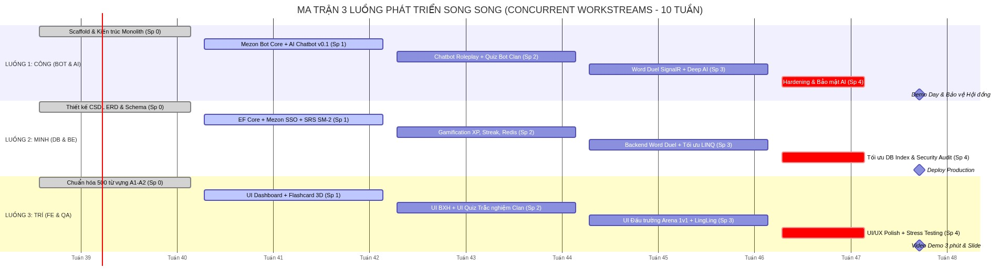

# 🚀 KẾ HOẠCH PHÂN CHIA SPRINT & LỘ TRÌNH PHÁT TRIỂN (SPRINT PLAN & ROADMAP)
## DỰ ÁN LINGUAL — NỀN TẢNG HỌC NGOẠI NGỮ XÃ HỘI TÍCH HỢP AI & MEZON PLATFORM
### CHƯƠNG TRÌNH THỰC CHIẾN MEZON CAMPUS STUDIO 2026 (MCS 2026)

> **Thông tin Định danh Đội ngũ & Dự án:**
> - **Tên dự án chính thức:** **LINGUAL**
> - **Đơn vị thực hiện:** **Team 05 — Đụt Cận Trĩ** (3 thành viên)
> - **Cộng đồng Mezon:** Mezon Campus Studio (Clan ID: `1840677019319275520`)
> - **Kênh trao đổi & Daily:** `#Team 05 - Đụt Cận Trĩa` & `#daily-team05`
> - **Mentor phụ trách:** **Mai Hồng Mận** (`man.maihong` - ID: `1827994776956309504`)
> - **Nhóm trưởng / Project Lead:** **Ngô Văn Công** (`MCS03_cong.ngovan` - ID: `2100896006294999040`): Quản lý dự án, Kiến trúc hệ thống, Trợ lý AI Mascot, Mezon Bot Client, SignalR Realtime Hub.
> - **Kỹ sư CSDL & Backend Core:** **Nguyễn Công Minh** (`MCS03_minh.nguyencong` - ID: `1967925734009737216`): Thiết kế Lược đồ CSDL ERD, EF Core Migrations, Thuật toán SRS SM-2, Gamification Redis.
> - **Kỹ sư Frontend & QA Testing:** **Phan Phước Trí** (`MCS03_tri.phanphuoc` - ID: `2041343127796584448`): Phát triển Giao diện Next.js 14 App Router, Chuẩn hóa Dữ liệu Từ vựng/Quiz, Kiểm thử tích hợp.
> - **Bộ công nghệ chính thức:** **Backend: ASP.NET Core 8 (Modular Monolith) + Frontend: Next.js 14 (App Router) + PostgreSQL 16 + Redis 7 + SignalR + Google Gemini AI**
> - **Mốc nộp Milestone 1:** **12/10/2026** (Nộp ERD Database, PRD thống nhất và Kế hoạch Sprint MVP)
> - **Mục tiêu hoàn thành toàn bộ Code:** **Tuần 9** (Tuần 10 dành cho Nghiệm thu, Video Demo và Bảo vệ Hội đồng)

---

## 🧭 CHƯƠNG 1: TỔNG QUAN PHƯƠNG PHÁP QUẢN TRỊ AGILE/SCRUM THEO LUỒNG SONG SONG

### 1.1 Triết lý vận hành: Phát triển Song song theo Luồng (Concurrent Workstreams)
Để tối ưu hóa thời gian và năng lực của từng thành viên trong chu kỳ 10 tuần, dự án **LINGUAL** áp dụng phương pháp luận **Agile/Scrum với cơ chế phân rã tính năng chạy song song (Parallel Workstreams)** thay vì triển khai tuần tự theo mô hình Thác nước (Waterfall) truyền thống.

Đội ngũ 3 thành viên của Team 05 được tổ chức thành **3 Trục chuyên môn độc lập nhưng liên tục tích hợp (Continuous Integration)**:
1. **Luồng 1 (Ngô Văn Công):** Phụ trách kiến trúc hệ thống, Mezon Bot Client, Trợ lý AI Mascot LingLing và SignalR GameHub. Triển khai Bot Mezon và kết nối AI cơ bản ngay từ Sprint 1.
2. **Luồng 2 (Nguyễn Công Minh):** Phụ trách tầng dữ liệu CSDL PostgreSQL, EF Core Migrations, Identity Auth Mezon SSO, Thuật toán lặp lại ngắt quãng SRS SM-2 và Gamification Redis.
3. **Luồng 3 (Phan Phước Trí):** Phụ trách tầng trải nghiệm người dùng Next.js 14 App Router, chuẩn hóa bộ dữ liệu từ vựng CEFR, ngân hàng câu hỏi Quiz và kiểm thử QA/QC toàn diện.

### 1.2 Nghi thức Scrum (Scrum Ceremonies)
1. **Daily Standup (Báo cáo hàng ngày):**
   - **Thời gian:** Trước 22:00 hàng ngày.
   - **Kênh thực hiện:** Kênh `#daily-team05` trên nền tảng Mezon Desktop.
   - **Hình thức:** Báo cáo qua bot hệ thống với cú pháp `*daily`.
   - **Nội dung:** Cô đọng 4 thông tin: (1) Công việc đã hoàn thành trong ngày, (2) Kế hoạch thực hiện ngày tiếp theo, (3) Rào cản/Vướng mắc kỹ thuật (Blockers), và (4) Thời lượng làm việc thực tế (tối thiểu 1 giờ/ngày).
2. **Sprint Planning & Backlog Refinement:** Đầu mỗi Sprint (Thứ Hai), nhóm họp rà soát User Stories, phân rã công việc chi tiết cho 3 luồng và xác định các điểm chạm tích hợp (Integration Points).
3. **Sprint Review & Demo với Mentor:** Họp định kỳ với Mentor Mai Hồng Mận trên Voice Channel Mezon để demo bản chạy thực tế và tiếp nhận phản hồi chuyên môn.
4. **Sprint Retrospective:** Họp nội bộ sau mỗi Sprint để đánh giá hiệu suất, tối ưu hóa quy trình và tháo gỡ khó khăn kỹ thuật cho kỳ tiếp theo.

### 1.3 Quy chuẩn Chất lượng (DoR và DoD)
* **Definition of Ready (DoR):** User Story có mô tả nghiệp vụ rõ ràng, tiêu chí nghiệm thu (Acceptance Criteria) xác định, thiết kế CSDL hoặc API Contract liên quan đã thống nhất giữa các thành viên.
* **Definition of Done (DoD):** Code tuân thủ Clean Architecture / Modular Monolith, có Unit Test cho logic cốt lõi (SRS SM-2, streak logic), pass 100% build `dotnet build` và `npm run build`, được ít nhất 1 thành viên review Pull Request, và tuyệt đối không lưu lộ khóa bí mật (Secrets).

### 1.4 Nguyên tắc Lập Kế hoạch Cuốn chiếu (Rolling-Wave Planning)
Nhóm áp dụng nguyên tắc lập kế hoạch thích ứng của Agile:
* **Sprint 0 & Sprint 1:** Kế hoạch thực thi chi tiết (Committed Sprint Backlog) với danh sách task và tiêu chí nghiệm thu cụ thể để đội ngũ bắt tay vào làm việc ngay.
* **Sprint 2 đến Sprint 4:** Khung tính năng định hướng (Indicative Feature Backlog) xác định các mục tiêu và tính năng cốt lõi (Epics). Danh sách task kỹ thuật chi tiết của từng Sprint sẽ được phân rã cụ thể trong phiên họp **Sprint Planning** đầu mỗi kỳ, dựa trên phản hồi thực tế từ các bản demo và định hướng từ Mentor.

---

## 🗺️ CHƯƠNG 2: LỘ TRÌNH TỔNG THỂ 10 TUẦN & MA TRẬN PHÂN BỔ THEO 3 LUỒNG SONG SONG

Lộ trình 10 tuần bám sát định hướng và các mốc kiểm soát chất lượng từ Mentor Mai Hồng Mận: **Hoàn tất toàn bộ việc viết code ở Tuần 9 (Feature Freeze), dành trọn vẹn Tuần 10 cho nghiệm thu, làm video demo và bảo vệ trước Hội đồng phản biện.**

*Hình: Ma trận 3 Luồng Phát triển Song song & Lộ trình 10 Tuần của LINGUAL (MCS 2026)*

### Bảng Tiến độ Tổng hợp Các Giai đoạn & Mốc Nộp:

| Giai đoạn | Mốc Thời gian | Tên Sprint | Trọng tâm Triển khai Của 3 Thành viên | Đầu ra Bắt buộc (Deliverables) |
| :--- | :---: | :--- | :--- | :--- |
| **Giai đoạn 1** | Tuần 1 - 2 | **Sprint 0: Khởi động & Milestone 1** *(Hạn chót: 12/10/2026)* | - **Minh:** Lược đồ CSDL ERD chi tiết. - **Công:** PRD, Kế hoạch Sprint & Scaffold Monolith. - **Trí:** Chuẩn hóa 500 từ vựng A1-A2 & Test Plan. | Bản vẽ ERD, Bản PRD & Sprint Plan `.docx`, Scaffold .NET + Next.js build xanh. |
| **Giai đoạn 2** | Tuần 3 - 4 | **Sprint 1: Core Engine & Learning v0.1** | - **Công:** Bot Mezon nhận lệnh + AI Chatbot v0.1 + Khung SignalR. - **Minh:** EF Core Migrations + Auth SSO Mezon + Thuật toán SRS SM-2. - **Trí:** UI Dashboard Next.js + Flashcard 3D + 300 câu hỏi Quiz. | Đăng nhập Mezon SSO, học từ vựng lật thẻ 3D có lưu tiến độ SM-2, Bot phản hồi lệnh. |
| **Giai đoạn 2** | Tuần 5 - 6 | **Sprint 2: Gamification & Interactive Bot v1.0** | - **Công:** Bot đố vui trong kênh Clan + Mascot LingLing roleplay. - **Minh:** Tính điểm XP, chuỗi Streak + Bảng xếp hạng trên Redis. - **Trí:** UI Bảng xếp hạng + UI làm Quiz + Thử nghiệm Clan Dev. | Bot đố vui tương tác nút bấm trong Clan Mezon, BXH Realtime trên Redis, tích lũy Streak. |
| **Giai đoạn 2** | Tuần 7 - 8 | **Sprint 3: Realtime Word Duel & Deep AI v2.0** | - **Công:** SignalR GameHub ghép cặp và thi đấu 1vs1 Word Duel. - **Minh:** Backend lưu lịch sử đấu, đồng bộ điểm, tối ưu LINQ. - **Trí:** UI Đấu trường Arena 1vs1 + UI Chatbot LingLing + Stress test. | Đấu từ vựng đối kháng 1vs1 thời gian thực mượt mà, AI LingLing phân tích lỗi sai thông minh. |
| **Giai đoạn 3** | Tuần 9 | **Sprint 4: Đóng băng Tính năng & Kiểm thử Bảo mật** | - **Cả 3 thành viên:** Khóa bổ sung tính năng mới. - **Công & Minh:** Security Audit (Rate limit, HMAC Webhook, SQLi, XSS). - **Trí:** Stress test chịu tải phòng đấu SignalR + Hoàn thiện UI/UX. | Báo cáo Security Audit chuẩn NCC+, kiểm thử chịu tải, hoàn thiện giao diện không lỗi. |
| **Giai đoạn 4** | Tuần 10 | **Nghiệm thu: Demo Day & Bảo vệ Hội đồng** | - **Công:** Triển khai VPS Production + Slide thuyết trình. - **Trí:** Sản xuất Video Clip Demo 3 phút Full HD. - **Cả nhóm:** Bảo vệ đề tài trước Hội đồng Giám khảo NCC+ & Mezon. | Hệ thống chạy live trên Production, Video demo 3 phút, Slide thuyết trình hoàn thiện. |

---

## 🔨 CHƯƠNG 3: CHI TIẾT SPRINT BACKLOG CHO 3 THÀNH VIÊN

> *Ghi chú phương pháp luận:* Các bảng công việc dưới đây thể hiện lộ trình phân rã tính năng theo từng Sprint. Trong đó, Sprint 0 và Sprint 1 là các task cam kết thực thi cụ thể; các Sprint tiếp theo (Sprint 2 - 4) đóng vai trò là khung tính năng định hướng (Indicative Backlog) và sẽ được nhóm rà soát, tinh chỉnh chi tiết trong mỗi phiên họp Sprint Planning tương ứng.

---

### 🚀 SPRINT 0: KHỞI ĐỘNG, THIẾT KẾ CƠ SỞ DỮ LIỆU & KHỞI TẠO HỆ THỐNG
* **Thời gian thực hiện:** Tuần 1 – Tuần 2 *(Hạn nộp bài Milestone 1: **12/10/2026**)*
* **Mục tiêu Sprint:** Hoàn thiện hồ sơ thiết kế kiến trúc, lược đồ CSDL ERD, dựng khung source code sạch đẹp sẵn sàng cho Sprint 1.

| Mã Task | Thành viên | Phân hệ | Mô tả chi tiết đầu việc | Điểm SP | Tiêu chí nghiệm thu (Acceptance Criteria) |
| :--- | :---: | :---: | :--- | :---: | :--- |
| **SP0-01** | **Minh** | Database | **Thiết kế Lược đồ CSDL (ERD & Schema 8 Module — 45 bảng):** Chuẩn hóa 8 file SQL ([docs/database/sql/](file:///c:/Study/HocKy6/MezonCampusStudio/docs/database/sql)): Identity, Curriculum, Learning/SRS, Quiz, Single-Clan Community (`bot_configuration`), Word Duel, AI LingLing, Analytics. Phân kỳ: Core MVP ~20 bảng vs Nâng cao 25 bảng. | 8 | File ERD hoàn chỉnh trên dbdiagram.io (`lingual_full_schema.dbml`), mô tả rõ kiểu dữ liệu, khóa chính, khóa ngoại, partial index trên PostgreSQL. |
| **SP0-02** | **Công** | Docs | **Đặc tả Yêu cầu Sản phẩm (PRD v1.1) & Kế hoạch:** Chuẩn hóa tài liệu PRD thống nhất kiến trúc Single-Clan Bot, sổ cái XP Ledger bất biến, 4 mức đánh giá SRS, xuất bản `.docx` chuẩn A4 có nhúng sơ đồ. | 5 | Bản PRD `.docx` và `.md` thống nhất không ràng buộc mã nguồn, được phê duyệt. |
| **SP0-03** | **Công** | Backend | **Khởi tạo Cấu trúc Backend ASP.NET Core 8 Modular Monolith:** Tạo Solution `Lingual.sln`, 7 projects độc lập (`Api`, `Shared`, `Identity`, `Learning`, `Gamification`, `MezonBot`, `AITutor`). | 5 | Build thành công 0 error, tích hợp Swagger tại root `/`, Health check `/health`, cấu hình CORS an toàn. |
| **SP0-04** | **Công** | Frontend | **Khởi tạo Ứng dụng Frontend Next.js 14 App Router:** Khởi tạo project trong `src/web-app`, cấu hình TailwindCSS, Lucide Icons, SignalR client. | 5 | Chạy `npm run build` thành công, tạo layout khung cho các trang: Dashboard, Học tập, Đấu trường, Hồ sơ. |
| **SP0-05** | **Công** | DevOps | **Cấu hình Môi trường Local Docker Compose:** Thiết lập file `docker-compose.yml` gồm PostgreSQL 16 Alpine và Redis 7 Alpine. | 3 | Gõ `docker compose up -d` khởi động thành công 2 dịch vụ, kết nối được bằng DBeaver/psql và redis-cli. |
| **SP0-06** | **Trí** | Content | **Chuẩn hóa Bộ Dữ liệu Từ vựng CEFR Ban đầu:** Thu thập và cấu trúc dữ liệu cho 500 từ vựng cốt lõi A1-A2 (Từ, phiên âm IPA, nghĩa tiếng Việt, câu ví dụ, audio URL). | 5 | File JSON / CSV dữ liệu từ vựng sạch, chuẩn hóa trường dữ liệu, sẵn sàng nạp vào DB. |

---

### 📦 SPRINT 1: NỀN TẢNG CORE DATABASE, MEZON BOT & CHATBOT AI v0.1
* **Thời gian thực hiện:** Tuần 3 – Tuần 4
* **Mục tiêu Sprint:** Thông luồng Đăng nhập Mezon SSO, Học từ vựng lật thẻ 3D có lưu thuật toán SM-2, Bot Mezon phản hồi lệnh và Chatbot AI giải đáp ngữ pháp ban đầu.

| Mã Task | Thành viên | Phân hệ | Mô tả chi tiết đầu việc | Điểm SP | Tiêu chí nghiệm thu (Acceptance Criteria) |
| :--- | :---: | :---: | :--- | :---: | :--- |
| **SP1-01** | **Minh** | Database | **Hiện thực hóa Entity Framework Core Data Access (Đợt 1 — 20 bảng Core MVP):** Tạo `LingualDbContext`, Fluent API mappings cho 20 bảng cốt lõi (Users, Curriculum, SRS Cards/Reviews, XP Ledger, Bot Configuration, Quiz, AI Messages), sinh migration trên PostgreSQL. | 8 | Chạy `dotnet ef database update` tạo thành công bảng trên DB PostgreSQL, seed dữ liệu mẫu 500 từ vựng. |
| **SP1-02** | **Minh** | Backend | **Module Identity & Mezon SSO Authentication Handshake:** API tiếp nhận Mezon OAuth token từ Webview/Bot, xác thực chữ ký số, tạo tài khoản người dùng và cấp JWT Bearer Token lưu in-memory. | 8 | Đăng nhập thành công trả về JWT token hợp lệ, lưu thông tin Mezon User ID, Display Name, Avatar URL. |
| **SP1-03** | **Minh** | Backend | **Thuật toán Spaced Repetition (SRS SM-2 Engine):** Hiện thực hóa thuật toán SM-2 tính toán khoảng thời gian lặp lại (Interval), yếu tố dễ nhớ (Easiness Factor $EF \ge 1.3$), và ngày đến hạn ôn tập (NextReviewDate). | 8 | Viết bộ Unit test kiểm thử đầy đủ các kịch bản chấm điểm 0 đến 5 điểm; công thức toán học chính xác 100%. |
| **SP1-04** | **Công** | AI / Bot | **Tích hợp Google Gemini API cho Chatbot v0.1 (Sửa lỗi ngữ pháp - P0):** Xây dựng service AI hỏi đáp ngữ pháp cơ bản: Tiếp nhận câu tiếng Anh của người dùng, phân tích lỗi sai và lưu vết vào `ai_messages`. | 8 | Endpoint `/api/v1/ai/chat` phản hồi dưới 2 giây, trả lời đúng trọng tâm ngữ pháp, có streaming text. |
| **SP1-05** | **Công** | Mezon Bot | **Kết nối Mezon Bot Client & Dựng khung SignalR:** Tiếp nhận lệnh cơ bản `/ping`, `/learn`, `/help` trên kênh Clan; dựng trước kết nối `GameHub` (SignalR) để chuẩn bị cho phòng đấu Webview. | 5 | Bot phản hồi lệnh trong kênh chat dưới 1 giây; SignalR kết nối thành công và gửi nhận tin nhắn echo. |
| **SP1-06** | **Trí** | Frontend | **Xây dựng Giao diện Học từ vựng (Flashcard 3D):** Màn hình lật thẻ từ vựng tương tác, hiển thị từ vựng, phiên âm IPA, phát âm mẫu, ví dụ thực tế và 4 nút đánh giá mức độ nhớ (Again, Hard, Good, Easy chuẩn UX Anki/Duolingo map quality 1-5). | 8 | Thao tác lật thẻ mượt mà, hỗ trợ phím tắt Space/Mũi tên, gọi API ghi nhận kết quả và tự chuyển thẻ tiếp theo. |
| **SP1-07** | **Trí** | QA | **Kiểm thử Luồng Học tập & Soạn thảo Bộ câu hỏi:** Viết kịch bản kiểm thử API luồng học tập; chuẩn bị thêm 300 câu hỏi trắc nghiệm kiểm tra từ vựng. | 5 | 100% API Sprint 1 có test case trên Postman; bộ câu hỏi có giải thích chi tiết đáp án đúng/sai. |

---

### 🎮 SPRINT 2: GAMIFICATION & INTERACTIVE MEZON BOT v1.0
* **Thời gian thực hiện:** Tuần 5 – Tuần 6
* **Mục tiêu Sprint:** Mini-game đố vui tương tác nút bấm trong Clan (Migration Đợt 2A: `clan_quiz_sessions`, `clan_quiz_responses`, `bot_schedules`), Mascot LingLing đóng vai đàm thoại (P1), hệ thống XP, Streak và BXH Clan trên Redis.

| Mã Task | Thành viên | Phân hệ | Mô tả chi tiết đầu việc | Điểm SP | Tiêu chí nghiệm thu (Acceptance Criteria) |
| :--- | :---: | :---: | :--- | :---: | :--- |
| **SP2-01** | **Minh** | Backend | **Hệ thống Điểm Kinh nghiệm XP & Chuỗi Ngày Streak:** Logic cộng điểm XP khi hoàn thành bài học, kiểm tra và bảo toàn chuỗi học liên tục hàng ngày (Quy tắc $\ge 20$ XP/ngày với timezone Việt Nam GMT+7). | 5 | Tự động tăng chuỗi nếu đạt $\ge 20$ XP trong ngày; reset về 0 nếu bỏ lỡ 1 ngày và hết Streak Freeze; ghi nhận sổ cái bất biến `xp_ledger`. |
| **SP2-02** | **Minh** | Backend | **Bảng xếp hạng Cá nhân & Clan Leaderboard (Redis):** Lưu trữ điểm XP tuần trên Redis Sorted Sets (`ZADD`, `ZREVRANGE`), endpoint lấy Top 10 cá nhân và Top Clan. | 8 | Thời gian truy vấn BXH dưới 10ms trên Redis; hỗ trợ phân trang và hiển thị thứ hạng của chính người học. |
| **SP2-03** | **Công** | Mezon Bot | **Mini-game Đố vui Từ vựng trong Kênh Chat Clan:** Khi người dùng gõ `/quiz`, bot tạo câu hỏi trắc nghiệm 4 đáp án dạng nút bấm tương tác, đếm ngược 30 giây (config) và công bố người trả lời đúng nhanh nhất. | 8 | Nút bấm phản hồi tức thì, ngăn chặn 1 người bấm 2 lần qua UNIQUE constraint; cộng trực tiếp XP cho người trả lời đúng. |
| **SP2-04** | **Công** | AI / Bot | **Nâng cấp Mascot LingLing Roleplay Tình huống (P1):** Prompt Engineering kịch bản đóng vai đàm thoại (Đi cafe, du lịch, phỏng vấn cơ bản); tự động phát hiện lỗi chính tả/ngữ pháp khi người dùng chat. | 8 | Mascot phản hồi tự nhiên, thân thiện; sửa lỗi sai theo mẫu: *"💡 Bạn nên nói: [câu sửa] thay vì [câu sai] nhé!"*. |
| **SP2-05** | **Trí** | Frontend | **Giao diện Bảng Xếp Hạng & Thống Kê Tiến Độ:** Màn hình hiển thị BXH cá nhân, BXH Clan, biểu đồ cột thống kê từ vựng đã học theo ngày và huy hiệu danh dự. | 5 | Giao diện hiện đại, responsive tốt trên cả màn hình nhỏ (webview Mezon) lẫn màn hình máy tính lớn. |
| **SP2-06** | **Trí** | QA | **Kiểm thử Xử lý Đồng thời trên Kênh Chat Clan:** Cùng các thành viên thử nghiệm gõ lệnh `/quiz` trong kênh chat để bắt lỗi phân luồng và trải nghiệm đồng thời. | 5 | Kiểm soát an toàn các điều kiện tranh chấp (Race Condition), không xuất hiện lỗi duplicate response. |

---

### ⚔️ SPRINT 3: REALTIME WORD DUEL 1vs1 & DEEP AI TUTOR v2.0
* **Thời gian thực hiện:** Tuần 7 – Tuần 8
* **Mục tiêu Sprint:** Ra mắt tính năng thi đấu đối kháng từ vựng 1vs1 thời gian thực (Migration Đợt 2B: `duel_matches`, `duel_match_questions`, `duel_answers`, `duel_results`) qua Webview nhúng Mezon (SignalR) và Thẻ vinh danh Clan.

| Mã Task | Thành viên | Phân hệ | Mô tả chi tiết đầu việc | Điểm SP | Tiêu chí nghiệm thu (Acceptance Criteria) |
| :--- | :---: | :---: | :--- | :---: | :--- |
| **SP3-01** | **Công** | Realtime | **SignalR GameHub & Thách đấu Word Duel (`/duel @user`):** Bot nhận lệnh thách đấu trong kênh Chat ➔ Bấm [Chấp nhận] ➔ Mở Webview nhúng Mezon kết nối `GameHub` SignalR độc lập để tránh spam kênh chat. | 8 | Trạng thái `accepted`, đếm ngược vào trận; tự động hủy nếu quá giờ (`no_show`); giải phóng room sạch sẽ. |
| **SP3-02** | **Công** | Realtime | **Cơ chế Thi đấu Trận chiến Từ vựng 5 Vòng Đồng bộ:** Mỗi trận đấu gồm 5 câu hỏi; server phát câu hỏi đồng bộ tới 2 người chơi; đồng hồ đếm ngược 10 giây/câu; tính điểm dựa trên độ chính xác và tốc độ (100–200đ/câu). | 8 | Điểm số và trạng thái trả lời của đối thủ được cập nhật trực tiếp (thời gian thực); chống gian lận chỉnh sửa đáp án ở client. |
| **SP3-03** | **Công** | AI / Bot | **Tích hợp AI LingLing Giải thích Sâu Lỗi sai:** Khi người học làm sai một câu trong Quiz hoặc sau trận Word Duel, LingLing tự động phân tích lý do sai và đưa ra mẹo ghi nhớ tương ứng. | 8 | Phân tích chính xác ngữ cảnh ngữ pháp của từ, gợi ý từ đồng nghĩa/trái nghĩa giúp người học nhớ lâu. |
| **SP3-04** | **Minh** | Backend | **Backend Lưu trữ Trận đấu & Vinh danh Điểm Clan:** Lưu lịch sử trận đấu vào `duel_matches`, `duel_match_questions`, `duel_answers`, `duel_results`; cộng XP trận thắng vào BXH Clan; Bot tự động bắn Thẻ kết quả vinh danh ra kênh Clan (`result_posted_at`). | 5 | Dữ liệu trận đấu được lưu toàn vẹn; cập nhật thứ hạng Clan ngay lập tức trên Redis; không đăng trùng card. |
| **SP3-05** | **Trí** | Frontend | **Màn hình Đấu trường Word Duel Arena & Chatbot LingLing:** Giao diện thi đấu đối kháng trực quan: Thanh máu / điểm số 2 bên, hiệu ứng âm thanh/chữ khi combo đúng liên tiếp, khung chat mascot LingLing. | 8 | Hiệu ứng sinh động, animation mượt mà, tối ưu không giật lag khi nhận sự kiện SignalR. |
| **SP3-06** | **Trí** | QA | **Kiểm thử Ngoại lệ & Khả năng Phục hồi Kết nối Mạng:** Giả lập tình huống rớt mạng giữa chừng (<10s cho reconnect, >10s forfeit xử thua), người chơi thoát ứng dụng đột ngột để kiểm tra tính an toàn. | 5 | Xử lý lỗi ngắt kết nối an toàn, không làm treo server hoặc đóng băng client còn lại. |

---

### 🛡️ SPRINT 4: ĐÓNG BĂNG TÍNH NĂNG, KIỂM THỬ BẢO MẬT THEO CHUẨN NCC+ & STRESS TESTING
* **Thời gian thực hiện:** Tuần 9 *(Đóng băng mã nguồn — hoàn thiện toàn bộ tính năng và kiểm thử)*
* **Mục tiêu Sprint:** Khóa bổ sung tính năng mới; tập trung nguồn lực vào kiểm tra an toàn bảo mật theo chuẩn NCC+, tối ưu hiệu năng và sửa lỗi.

| Mã Task | Thành viên | Phân hệ | Mô tả chi tiết đầu việc | Điểm SP | Tiêu chí nghiệm thu (Acceptance Criteria) |
| :--- | :---: | :---: | :--- | :---: | :--- |
| **SP4-01** | **Công, Minh** | Security | **Rà soát & Thắt chặt An toàn Thông tin theo Tiêu chuẩn NCC+:** - Bật cơ chế Rate Limiting chống DDoS/Spam API. - Kiểm tra chữ ký HMAC trên Webhook Mezon. - Rà soát chống SQL Injection, XSS, CSRF, cấu hình CORS nghiêm ngặt. - Quét secret bằng công cụ tự động để đảm bảo không rò rỉ token. | 8 | Báo cáo Security Audit đạt chuẩn, không còn lỗ hổng ở mức High hay Critical; các API công khai đều có Rate Limit. |
| **SP4-02** | **Minh** | Backend | **Tối ưu Hóa Hiệu năng Cơ sở Dữ liệu & Cache:** Thêm chỉ mục (Index) trên các trường tìm kiếm thường xuyên (`mezon_user_id`, `next_review_at`, `status`); tối ưu hóa các câu lệnh truy vấn LINQ / EF Core. | 5 | 95% API trả về kết quả trong thời gian dưới 200ms; không xảy ra hiện tượng N+1 Query. |
| **SP4-03** | **Trí, Công** | QA | **Kiểm thử Chịu tải Phòng đấu SignalR (Stress Testing):** Sử dụng công cụ kiểm thử tải (k6 / NBomber) giả lập 100 người dùng đồng thời kết nối vào GameHub và làm quiz. | 5 | Server duy trì ổn định, RAM tiêu thụ dưới 500MB, không mất gói tin thời gian thực. |
| **SP4-04** | **Trí** | Frontend | **Chuẩn hóa Giao diện Người dùng & Tương thích Môi trường Nhúng:** Kiểm tra tính tương thích trên các kích thước màn hình điện thoại, máy tính bảng và màn hình nhúng bên trong Mezon Desktop. | 5 | Giao diện không vỡ layout, font chữ rõ ràng, độ tương phản màu sắc đạt chuẩn WCAG AA. |

---

### 🏆 GIAI ĐOẠN ĐÍCH: NGHIỆM THU, DEMO DAY & BẢO VỆ ĐỀ TÀI
* **Thời gian thực hiện:** Tuần 10
* **Mục tiêu:** Đóng gói sản phẩm hoàn chỉnh, triển khai môi trường Production, quay video demo chuyên nghiệp và bảo vệ đề tài trước Hội đồng Giám khảo.

| Mã Task | Thành viên | Hạng mục | Mô tả chi tiết đầu việc | Điểm SP | Tiêu chí nghiệm thu (Acceptance Criteria) |
| :--- | :---: | :---: | :--- | :---: | :--- |
| **FN-01** | **Công** | DevOps | **Triển khai Production (Production Deployment):** Đóng gói ứng dụng vào Docker containers, deploy lên máy chủ VPS / Cloud, cấu hình Domain HTTPS và Reverse Proxy Nginx. | 8 | Hệ thống hoạt động trực tiếp trên Internet 24/7 với chứng chỉ SSL hợp lệ. |
| **FN-02** | **Trí** | Media | **Sản xuất Video Clip Demo Sản phẩm (2-3 phút):** Biên kịch và quay video thể hiện trọn vẹn 3 trụ cột: Học từ vựng SRS, Đố vui Bot trong kênh Clan, và Đấu trường đối kháng Word Duel 1vs1. | 8 | Video chất lượng Full HD, âm thanh thuyết minh rõ ràng, có phụ đề, thời lượng chuẩn 2-3 phút. |
| **FN-03** | **Công, Minh** | Presentation | **Soạn thảo Slide Báo cáo & Tài liệu Nghiệm thu:** Thiết kế Slide thuyết trình chuyên nghiệp, tóm lược bài toán, giải pháp kỹ thuật, demo và định hướng tương lai. | 5 | Slide ấn tượng, súc tích, làm nổi bật được giá trị độc đáo mà LINGUAL mang lại cho hệ sinh thái Mezon. |
| **FN-04** | **Cả 3 thành viên** | Defense | **Bảo vệ Đề tài trước Hội đồng Giám khảo NCC+ & Mezon:** Thuyết trình trực tiếp, trả lời các câu hỏi phản biện chuyên sâu về kiến trúc Modular Monolith, bảo mật và khả năng mở rộng. | 8 | Hoàn thành buổi bảo vệ, nhận phản hồi chuyên môn và chứng nhận từ chương trình. |

---

## 👥 CHƯƠNG 4: MA TRẬN PHÂN CÔNG TRÁCH NHIỆM (RACI MATRIX)

Mô hình RACI được phân định rõ ràng giữa 3 thành viên của Team 05 và Mentor hướng dẫn:
- **R (Responsible):** Người trực tiếp thực hiện công việc.
- **A (Accountable):** Người chịu trách nhiệm cuối cùng về chất lượng và tiến độ (Nhóm trưởng).
- **C (Consulted):** Người được tham vấn chuyên môn (Mentor hoặc thành viên phụ trách chuyên sâu).
- **I (Informed):** Người được thông báo kết quả.

### Bảng Ma trận RACI Xuyên suốt Dự án:

| Đầu việc / Module chức năng | Ngô Văn Công (Lead) | Nguyễn Công Minh (BE) | Phan Phước Trí (FE/QA) | Mai Hồng Mận (Mentor) |
| :--- | :---: | :---: | :---: | :---: |
| **Thiết kế Database Schema & ERD** | A, C | **R** | I | C |
| **Tài liệu PRD/SRS & Kế hoạch Sprint** | **R, A** | C | C | C, I |
| **Scaffold Backend (.NET) & Frontend (Next.js)** | **R, A** | I | I | I |
| **Môi trường Docker Compose (DB + Redis)** | **R, A** | C | I | I |
| **Xây dựng Data Access (EF Core Migrations)** | A | **R** | I | C |
| **Module Identity & Mezon SSO Authentication** | A | **R** | I | C |
| **Thuật toán Spaced Repetition (SRS SM-2)** | A | **R** | I | C |
| **Giao diện Học từ vựng Flashcard 3D** | A | I | **R** | I |
| **Chuẩn hóa Bộ dữ liệu Từ vựng Oxford/CEFR** | A | I | **R** | I |
| **Ngân hàng Câu hỏi Quiz Trắc nghiệm** | A | I | **R** | I |
| **Module Gamification (XP, Streak, Leaderboard)** | A | **R** | I | I |
| **Tích hợp Mezon Bot & Kênh Clan Interactive** | **R, A** | I | C | C |
| **Chatbot AI Mascot LingLing (Google Gemini)** | **R, A** | I | C | C |
| **SignalR GameHub cho Word Duel 1vs1** | **R, A** | C | I | C |
| **Giao diện Đấu trường Word Duel Arena UI** | A | I | **R** | I |
| **Security Audit & Tuân thủ Chuẩn NCC+** | **R, A** | **R** | I | **C** |
| **Kiểm thử Hiệu năng & Chịu tải (Stress Test)** | A | C | **R** | I |
| **Sản xuất Video Demo Sản phẩm (2-3 phút)** | A | I | **R** | C |
| **Triển khai Production & Bảo vệ Hội đồng** | **R, A** | **R** | **R** | **C** |

---

## ⚡ CHƯƠNG 5: KỶ LUẬT ĐỘI NGŨ & CHỈ SỐ ĐO LƯỜNG TIẾN ĐỘ

### 5.1 Quy định Kỷ luật Làm việc Nhóm
1. **Cam kết Báo cáo Hàng ngày (Daily Discipline):**
   - Mọi thành viên bắt buộc gõ lệnh `*daily` trên kênh `#daily-team05` trước 22:00 mỗi ngày làm việc.
   - Thời gian làm việc ghi nhận tối thiểu: **1 giờ / ngày**. Không dồn báo cáo nhiều ngày vào một lần.
   - Nếu gặp rào cản kỹ thuật kéo dài quá 4 tiếng mà không giải quyết được, thành viên cần tag nhóm trưởng và Mentor trên kênh `#Team 05 - Đụt Cận Trĩa` để được hỗ trợ tháo gỡ.
2. **Quy chuẩn Quản lý Mã nguồn (Git Discipline):**
   - Nhánh `main`: Chỉ chứa mã nguồn sản phẩm đã qua kiểm định, sẵn sàng deploy hoặc nộp milestone.
   - Nhánh `develop`: Nhánh tích hợp chính của Sprint hiện tại.
   - Nhánh tính năng: Đặt tên theo cú pháp `feature/spX-ten-tinh-nang` (Ví dụ: `feature/sp1-srs-engine`).
   - Tuyệt đối không push trực tiếp lên `main`. Bắt buộc phải tạo Pull Request có ít nhất 1 phê duyệt từ thành viên khác.

### 5.2 Các Chỉ số Đánh giá Tiến độ (Performance Metrics)
* **Sprint Velocity:** Tổng số Story Points hoàn thành thực tế so với số điểm cam kết ban đầu của Sprint (Mục tiêu đạt $\ge 85\%$).
* **Defect Density (Mật độ lỗi):** Tỷ lệ lỗi tìm thấy trong giai đoạn Sprint Review so với số tính năng bàn giao (Mục tiêu dưới 0.2 bug/Story Point).
* **On-time Delivery Rate:** Mức độ hoàn thành các mốc nộp bài đúng hạn theo yêu cầu của Ban tổ chức (Mục tiêu đạt 100% đúng hạn).

---

## 🛡️ CHƯƠNG 6: QUẢN TRỊ RỦI RO & PHƯƠNG ÁN DỰ PHÒNG (RISK MANAGEMENT)

| Mã Rủi ro | Nguy cơ / Tình huống | Mức độ | Khả năng | Giải pháp Phòng ngừa & Khắc phục Dự phòng (Contingency Plan) |
| :--- | :--- | :---: | :---: | :--- |
| **RSK-01** | **Tài liệu hoặc API của Mezon Platform thay đổi:** Webhook hoặc Bot SDK có cập nhật mới làm ảnh hưởng tính năng. | Cao | Trung bình | Tách riêng tầng Adapter trong module `Lingual.Modules.MezonBot`. Nếu SDK gặp lỗi, chuyển sang gọi trực tiếp qua REST API hoặc Webhook HTTP chuẩn của Mezon. |
| **RSK-02** | **Độ trễ mạng hoặc SignalR rớt kết nối khi thi đấu 1vs1:** Đường truyền không ổn định dẫn đến mất đồng bộ câu hỏi. | Trung bình | Cao | Thiết lập cơ chế Heartbeat định kỳ 5 giây; lưu trạng thái trận đấu trên Redis. Nếu mất kết nối dưới 10 giây, cho phép người chơi Reconnect vào lại trận ngay lập tức. |
| **RSK-03** | **Quá tải hạn mức (Quota Limit) của Google Gemini AI:** API AI bị giới hạn số lượt gọi/phút làm chậm phản hồi của mascot LingLing. | Trung bình | Trung bình | Lưu bộ nhớ đệm (Cache) các câu trả lời giải thích ngữ pháp phổ biến trên Redis; áp dụng hàng đợi (Queue) điều tiết tốc độ gọi API; có kịch bản câu trả lời dự phòng khi AI quá tải. |
| **RSK-04** | **Thành viên trong nhóm vướng lịch thi học kỳ ở trường:** Năng lực thực hiện giảm trong 1-2 tuần cao điểm. | Cao | Cao | Bám sát nguyên tắc **MVP Cốt lõi**: Ưu tiên hoàn thành các tính năng P0 trước; các tính năng P1/P2 có thể linh hoạt giản lược quy mô mà không làm ảnh hưởng đến tính toàn vẹn của sản phẩm. |
| **RSK-05** | **Áp lực tiến độ Tuần 9 (Feature Freeze):** Khối lượng công việc tồn đọng trước giai đoạn đóng băng mã nguồn. | Rất cao | Trung bình | Kiểm soát chặt chẽ Scope ngay từ Sprint 1; loại bỏ việc phát sinh tính năng ngoài kế hoạch (Scope Creep). Mọi tính năng phụ dời sang các phiên bản tiếp theo. |

---

## 🎯 CHƯƠNG 7: KẾT LUẬN & CAM KẾT TRIỂN KHAI

Kế hoạch Sprint của dự án **LINGUAL** được xây dựng dựa trên nguyên tắc **khả thi, tập trung và thích ứng nhanh**:
1. **Phân bổ nguồn lực cân đối:** Phân định rõ 3 luồng công việc độc lập cho 3 thành viên, liên tục tích hợp tại mỗi mốc Sprint nhằm loại bỏ nút thắt phụ thuộc.
2. **Chiến lược phân kỳ thực tế (Phased Delivery):** Tập trung hoàn thiện vượt trội các tính năng cốt lõi (Học từ vựng thông minh SRS SM-2, Đố vui tương tác Clan và Đấu trường Word Duel 1vs1) trước khi mở rộng các phân hệ phụ trợ.
3. **Tuân thủ quy chuẩn chất lượng:** Khóa tính năng ở Tuần 9 để thực hiện kiểm định bảo mật nghiêm ngặt theo chuẩn NCC+, đảm bảo sản phẩm đạt chất lượng cao nhất khi bàn giao và bảo vệ tại Tuần 10.
