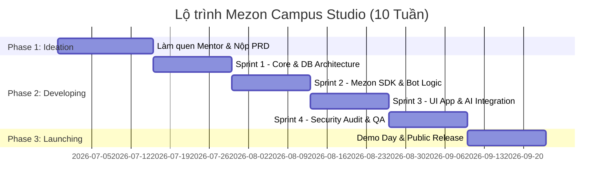

# 🗺️ LỘ TRÌNH 10 TUẦN & SPRINT ROADMAP
> ⚠️ Tài liệu lịch sử: lộ trình gốc của chương trình (đã kết thúc 09/2026). Kế hoạch thực thi hiện tại xem tại [SPRINT_PLAN_LINGUAL_MCS2026.md](SPRINT_PLAN_LINGUAL_MCS2026.md) (Milestone 1, hạn 12/10/2026).

## CHƯƠNG TRÌNH MEZON CAMPUS STUDIO 2026

> **Học viên:** Ngô Văn Công  
> **Cam kết:** Tối thiểu 1-2h/ngày và 15h/tuần  
> **Phương pháp quản lý:** Agile/Scrum Weekly Sprint  

---

### 📌 TỔNG QUAN 3 GIAI ĐOẠN

---

### 🚩 CHI TIẾT CÁC SPRINT TUẦN TỰ

#### 🚀 GIAI ĐOẠN 1: KICKOFF & KHỞI TẠO Ý TƯỞNG (TUẦN 1 - 2)
- [x] **Tuần 1:** Thiết lập Workspace, Git Repository, môi trường phát triển (Node.js, Python, PostgreSQL, Redis).
- [ ] **Tuần 2:** Lựa chọn đề tài bài toán cụ thể, hoàn thiện tài liệu `PRD.md` và trình bày Mentor NCC+ duyệt.

#### 🔨 GIAI ĐOẠN 2: THỰC THI & PHÁT TRIỂN SPRINT (TUẦN 3 - 8)
- [ ] **Sprint 1 (Tuần 3 - 4) — Cốt lõi & Dữ liệu:**
  - Thiết kế Schema cơ sở dữ liệu trên PostgreSQL.
  - Xây dựng tầng truy cập dữ liệu (ORM/Repository) và cấu hình Caching Redis.
  - Setup CI/CD và Unit test pipeline cơ bản.
- [ ] **Sprint 2 (Tuần 5 - 6) — Tích hợp Mezon Platform:**
  - Tích hợp `mezon-sdk` hoặc Webhook Handler.
  - Hiện thực hóa các tương tác Bot (nhận diện lệnh, gửi tin nhắn định dạng phong phú, buttons, embeds).
  - Kết nối thử nghiệm trực tiếp trên Clan Dev của Mezon.
- [ ] **Sprint 3 (Tuần 7 - 8) — Hoàn thiện Tính năng & Trải nghiệm:**
  - Phát triển tính năng nâng cao (AI Agent, Mini-app Webview hoặc Automation engine).
  - Tối ưu hóa thời gian phản hồi dưới 500ms.
  - Kiểm thử tải (Load test) và kiểm tra tương thích đa thiết bị.

#### 🛡️ GIAI ĐOẠN BẢO MẬT & KIỂM ĐỊNH (TUẦN 9)
- [ ] **Sprint 4 (Tuần 9) — Security Audit NCC+:**
  - Thực hiện Audit bảo mật toàn diện (OWASP Top 10, chống lộ API key, rate limit, kiểm tra quyền hạn RBAC).
  - Sửa toàn bộ các lỗi phát hiện được từ buổi review của Mentor/Security Specialist.

#### 🏆 GIAI ĐOẠN 3: PHÁT HÀNH & DEMO DAY (TUẦN 10)
- [ ] **Tuần 10 — Public Launching:**
  - Triển khai sản phẩm lên môi trường Production (VPS / Cloud / Mezon Store).
  - Chuẩn bị Slide thuyết trình, Video demo kịch bản và báo cáo tổng kết (Final Report).
  - Trình bày Demo Day trước Hội đồng ban cố vấn NCC+ và nhận chứng nhận kinh nghiệm thực tế.
